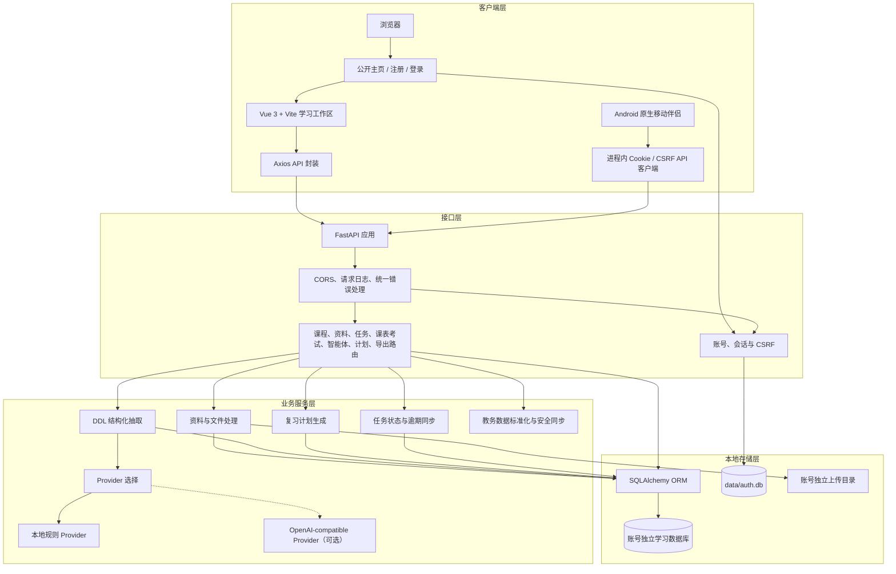
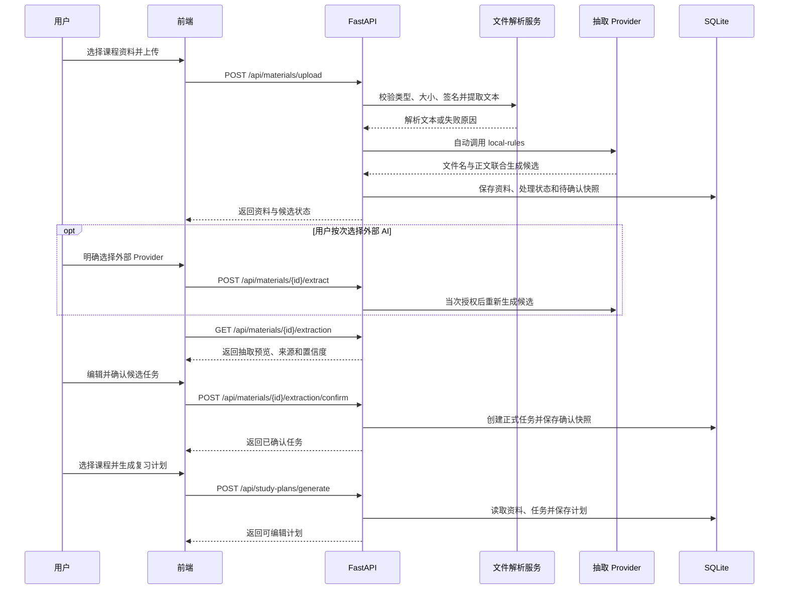

# 学伴管家架构与技术路线

_面向 M8 智能体能力增强的系统架构说明，最后核对日期：2026-09-02_

---

## 🧭 系统概览

学伴管家当前是一个带本地邮箱账号的学习资料、DDL 任务、课表考试和复习计划管理应用。公开主页负责说明产品闭环，注册登录建立个人会话，登录后的 Vue 前端负责完整管理与证据复核，原生 Android 伴侣负责高频的今日行动、课表考试和 DDL 完成；后端统一负责账号边界、业务规则、文件解析、结构化抽取、学期日程、数据持久化和导出。M8 在此基线上增加智能体编排层，不推翻现有资料、任务和计划服务。

## 📌 版本基线

| 维度 | 当前基线 |
| --- | --- |
| 交付形态 | 本地邮箱账号开发版；账号学习工作区相互隔离 |
| 前端 | Vue 3 + Vite + Element Plus，路由和业务页面按需加载 |
| Android | Kotlin 2.2.21 + Jetpack Compose；SDK 36，最低 API 26；Gradle Wrapper 8.13 |
| 后端 | FastAPI + SQLAlchemy + Pydantic |
| 持久化 | `data/auth.db` 保存账号与会话；既有账号使用 `data/app.db`，后续账号使用 `data/users/<workspace>.db`；上传文件按账号命名空间存储 |
| 抽取策略 | 默认本地规则；外部 OpenAI-compatible Provider 由用户按次选择 |
| 当前验证 | 后端完整 197 项与前端 `npm run verify` 通过；Android 单元测试、lint、Debug APK 构建通过，并在 API 36.1 模拟器走通隔离账号登录、今日时间轨道、课表考试、DDL 和任务完成写回。既有隔离浏览器已走通桌面七日课表、375×840 按天课表和 `.ics` 三步导入；南理工真页面仅验收无凭据界面，不使用真实学号登录。原用户库迁移、公网部署、真实教务账号、真实屏幕阅读器、实体键盘和系统级大字号未作本轮验收 |
| 非目标 | 公网生产、高并发租户平台、对象存储、邮箱验证与密码恢复 |



## 🧩 核心组件

| 组件 | 代码位置 | 责任 |
| --- | --- | --- |
| Vue 前端 | `frontend/src/` | 公开主页、账号表单、受保护路由、学习工作区、课表考试、上传、抽取确认、计划编辑和导出入口 |
| Android 伴侣 | `android/app/src/main/` | 登录、今日时间轨道、课表考试、DDL 队列、任务完成和移动隐私边界；不采集教务凭据 |
| FastAPI 应用 | `backend/app/main.py` | 生命周期、CORS、请求日志、异常处理和路由注册 |
| API 路由 | `backend/app/api/` | 对外 HTTP 接口和请求级校验 |
| 账号与会话服务 | `backend/app/api/auth.py`、`backend/app/services/auth.py` | 邮箱注册登录、密码哈希、Cookie 会话、CSRF 与管理员校验 |
| 业务服务 | `backend/app/services/` | 文件解析、DDL 抽取、Provider、任务和计划生成规则 |
| 教务日历接入 | `backend/app/services/academic_calendar_sync.py`、`backend/app/services/njust_academic.py` | 解析标准 iCalendar；或以短时内存会话直连南理工、解析课表/考试并立即清除凭据；统一生成预览和内容散列 |
| 数据模型 | `backend/app/models/` | Course、ClassSession、Exam、AcademicCalendarSyncLink、Material、Task、StudyPlan 及计划明细 |
| 账号 SQLite | `data/auth.db` | 账号公共信息、密码哈希和会话 token/CSRF 哈希 |
| 学习工作区 SQLite | `data/app.db`、`data/users/<workspace>.db` | 首个账号的兼容工作区与后续账号相互独立的业务数据 |
| 原始文件目录 | `data/uploads/` | 首个账号根目录文件与后续账号的独立子目录 |

## 🔐 账号与工作区边界

注册成功即建立会话；邮箱先规范化再唯一校验，密码使用随机盐 `scrypt` 哈希。浏览器只通过 SameSite=Lax Cookie 携带会话，其中 session Cookie 为 HttpOnly，服务端数据库只保存 token 哈希；所有修改请求还要同时提交可读 CSRF Cookie 对应的请求头。认证响应设置 `Cache-Control: no-store`，未知邮箱也执行同成本的密码校验，降低廉价的账号存在性旁路。

除公开主页、`/api/auth/*` 和 `/api/health` 外，所有业务路由统一依赖当前账号。第一个注册账号为兼容账号：接管已有 `data/app.db` 与根上传目录，并成为实例管理员；后续账号使用随机工作区键映射到独立 SQLite 文件和上传子目录。业务路由从会话解析工作区，客户端不能自行提交数据库路径或工作区键。

该方案解决本地评审与开发阶段的个人账号边界，不等同于生产 SaaS 租户架构。当前没有邮箱所有权验证、密码恢复、登录限流、账号冻结、静态加密、集中式备份恢复和运维审计，也未验证真实公网服务器。

### Android 会话与连接边界

Android 客户端复用同一邮箱账号 API，不另建移动端 token 旁路。登录响应中的 `study_session` 与 `study_csrf` 只进入进程内白名单 Cookie 容器；写请求附加 CSRF，请求完成任务时同时提交服务端不可复用身份与版本 `If-Match`。密码不进入 `ViewModel`、`SharedPreferences` 或日志，表单触发登录后立即清空；应用退出或进程被系统结束后需要重新登录。

手机只保存经过严格解析的服务地址和所选教学周。地址不允许包含用户信息、查询参数、锚点或 `/api` 之外的任意路径；Release 构建从 Manifest 到代码均拒绝 HTTP。Debug 为支持 ADB reverse 开启明文网络能力，但代码仍只接受回环或 RFC 1918 私有 IPv4，推荐使用 USB 反向端口把 `127.0.0.1` 映射到本机 FastAPI，避免把开发服务暴露到局域网。

## 🗓️ 学期日程边界

课表与考试继续使用当前账号的独立学习工作区，并复用 `Course` 作为课程事实来源；删除课程时，所属 `ClassSession` 与 `Exam` 由数据库级联删除，避免留下无归属日程。课表记录星期、上下课时间、起止周和每周/单双周模式；冲突校验只在两个记录至少共享一个实际生效周次且时间重叠时拒绝，因此单双周错开的相同时段可并存。

考试时间在请求入口按北京时间解释并统一存为 UTC，响应只做一次 UTC 规范化，前端固定按 `Asia/Shanghai` 展示。课表与考试都持久化不可复用导航身份和版本号，更新、删除要求提交 `If-Match`，旧页面不能覆盖较新的修改。

“接入教务”有两条输入路径。标准 iCalendar 路径由客户端读取 `.ics` 并发送本次内容，不接收账号密码；南理工路径由本机 FastAPI 使用固定学校端点建立最长 5 分钟的验证码 Cookie 会话，登录请求结束即关闭并移除，账号密码、Cookie、验证码和原始 HTML 均不落盘。两条路径都只返回不落库预览，用户选中后才写入；同步身份表仅保留来源名称散列、外部 UID、本地不可复用身份和上次应用内容散列。

南理工适配器优先使用 `8080` 门户的 POST 登录，再读取 `9080` 教务数据；在旧门户不可达时兼容 `9080` 直连入口。所有地址固定在服务端、禁用环境代理并限制响应大小，避免被用作任意凭据转发或 SSRF。由于学校现有端点是 HTTP，页面要求显式确认传输风险；“本机处理”只表示数据不经过本项目的第三方解析服务器，不等同于本机到学校之间已加密。

课表周次仍可由用户在第 1—30 周中选择；确认导入后，前端会用本次第一周日期切换到当前教学周，但尚未把学期配置持久化为全站设置。课表和考试暂不自动生成 DDL、不改变智能体容量或复习计划。南理工适配器为非官方、页面结构依赖型实现，不代表学校授权，也不扩展为任意学校凭据代理。

## 🤖 智能体目标架构

M8 的核心不是增加一个自由聊天接口，而是在现有业务服务之上加入受控的“观察—判断—建议—执行—反馈”编排层。现有资料解析、DDL 抽取、任务服务和计划服务继续作为确定性工具；智能体只能组合这些工具允许的候选动作。

| 目标组件 | 输入 | 输出 | 持久化与边界 |
| --- | --- | --- | --- |
| 事件记录器 | 资料处理、抽取确认、任务变化、计划项变化 | `AgentEvent` | 事件只引用业务对象，不复制完整敏感正文 |
| 状态聚合器 | 未完成任务、截止时间、资料状态、计划、学习偏好 | 当前学习状态快照 | 统一使用服务端时间和数据库事实 |
| 风险与容量引擎 | 剩余时间、预计用时、每日容量、优先级和冲突 | 风险等级、原因码和计算明细 | 首版使用可解释规则，不依赖外部模型 |
| 今日决策投影 | 资料状态、仍有效建议、当前容量候选 | 最多 5 条固定决策、优先级、原因码和单个来源引用 | 只读排序与对象去重；不读取建议 JSON 载荷、不生成路由、更不执行动作 |
| 建议生成器 | 状态快照、风险结果和白名单动作 | `AgentSuggestion` | 每条建议包含来源、原因、置信度和过期条件 |
| 确认与执行网关 | 用户接受或修改后的候选 | 任务/计划变更与 `ActionReceipt` | 再次校验状态、参数和幂等键；失败整体回滚 |
| 反馈与重规划器 | 完成状态、实际用时、新任务和逾期事件 | 新一轮建议或计划差异 | 只生成候选差异，不覆盖人工计划和已完成内容 |

已实现的 M8.1—M8.30 能力（M8.14—M8.28 未新增接口；M8.29 扩展来源身份，M8.30 扩展编辑版本与可选前置条件，保留既有接口路径）：

- `GET /api/agent/briefing`：使用单次评估时刻统一返回学习收件箱、容量快照、最多 5 条只读今日决策、最多 3 条今日行动、容量行动、待确认建议和最近 5 条终态结果/回执；今日决策只给出固定文案、风险、原因码与单个来源引用，仍须经 resolver 导航；
- `POST /api/agent/refresh`：基于当前数据库状态生成或刷新建议，首版同步执行且不调用外部 AI；
- `GET /api/agent/suggestions`：默认保留临期优先级建议兼容视图，显式状态过滤可审计全部白名单动作；
- `POST /api/agent/suggestions/{id}/accept`：接受 `adjust_priority`、`set_task_estimate` 或 `start_task`，仅允许该动作声明的受限字段；
- `POST /api/agent/suggestions/{id}/dismiss`：忽略建议并记录原因；
- `GET /api/agent/capacity`：返回未来 7 天总容量、北京时间单日风险、缺失估时、同日 DDL 和计算快照；
- `POST /api/agent/tasks/{id}/complete`：可选提交实际用时和难度，返回完成后的任务与持久执行回执；旧任务完成入口复用同一服务；
- `GET /api/agent/calibration?course_id=`、`POST /api/agent/calibration/{course_id}/reset`：查询或重置课程估时依据，历史任务反馈不被删除；
- `GET /api/agent/plan-deltas`、`POST /api/agent/plan-deltas/{id}/accept`：查询仍可执行的计划差异并在快照重验后幂等应用；
- `GET /api/agent/weekly-review`、`POST /api/agent/weekly-review/refresh`、`GET /api/agent/weekly-reviews?limit=1..12`：读取当前复盘、保存真实窗口快照并查询有界历史；已结束窗口冻结，缺失周不补造；
- `GET/PATCH /api/agent/reminder-preferences`、`GET /api/agent/reminders?presentation=true`：服务端校验类别、风险阈值和站内摘要频率；高风险事实始终呈现，日/周摘要不触发外部推送；
- `POST /api/agent/source-navigation/resolve`：批量解析有界来源引用。服务端仅返回固定的站内 path/query；前端再次校验白名单后才路由。任务、资料、计划、计划项、执行回执和命名集合都会先检查当前可用性，删除来源不生成替代地址；
- `GET /api/agent/learning-trends`：读取最近 28 个北京时间自然日的真实完成反馈，返回学习日分布、最长空档、负荷集中度、完成节奏、样本和限制；没有写接口。课程校准只作上下文，趋势候选固定为只读复核；
- `GET /api/agent/learning-rhythm-history`：只读取关闭后的周度快照摘要；仅当两个最新关闭窗口具有相同节奏摘要版本、口径与最低有效样本时才比较，其他情况返回不可比原因，绝不从当前趋势重算或补造历史；
- `GET /api/agent/activity?limit=1..50`：稳定倒序读取已持久化的事件、建议、回执和规则运行记录，投影为有界用户时间线；不刷新智能体、不写库、不返回内部 JSON 载荷、路径或异常文本，数据库查询也只读取公共投影所需列，来源仅返回 resolver 白名单引用；
- `GET/PUT /api/study-preferences`、`POST /api/study-preferences/reset`：读取、修改和恢复个人学习容量与偏好。

M8.15—M8.28 在现有契约之上增加双层前端信息架构、可访问操作、真实首轮引导、今日行动舞台、性能、阅读、可见学习流、DDL 行动、资料确认优先、复习执行与任务来源边界：

- 应用外壳以单例组合式状态维护“简洁视图 / 详细视图”，只持久化固定枚举值，读取失败时安全回到简洁视图；
- 简洁视图面向普通大学生，优先呈现今日决策、行动状态、风险和人工确认入口；普通长列表受限，但服务端判定的高风险事实不隐藏，关键写操作和确认门禁也不移除；
- 详细视图面向复核与解释，恢复完整证据、活动历史、复盘趋势、筛选、表格、导出和校准依据；
- 任务、资料、复习计划和设置分别采用行动卡片、三阶段资料链路、真实编排顺序和规则索引。来源导航仍只能消费 `POST /api/agent/source-navigation/resolve` 返回的白名单站内目标，视图切换不会改变业务授权或服务端事实。
- M8.17 将可访问操作作为前端交互约束：路由 `path` 变化后聚焦 `main`，skip link 显式聚焦主内容且同页 hash 锚点不受影响；固定移动底栏处理 safe-area 并预留底部空间，移动输入字号保持 16px；支持 reduced motion，警告和灰色文本使用提升后的对比度。
- 设置简洁视图展示三块摘要，编辑时切换到详细视图并聚焦对应区块；高风险提醒和外部 AI 按次授权/正文可能外传边界始终可见。任务与资料简洁卡片分离主要操作和其他操作，详细视图保留完整能力；资料识别入口仅在 `processed` 且存在 `extracted_text` 时呈现。
- M8.18 将第一轮学习路径封装为无网络的 `FirstLearningLoop` 展示组件：父页面只传入已经严格校验的 Dashboard 计数和可用资料来源，组件只计算四步状态并发出固定动作；进度不读取 Agent 队列、`next_action` 或推断结果。`create-course`、`upload`、`create-task` 是页面内固定 action token，消费后只删除自身 query；任意证据来源仍必须先经过服务端 resolver。
- Dashboard、任务、资料、计划和设置以 `loading/ready/error/invalid` 或等价状态区分未加载、真实空和失败。失败时清空易误导的旧行、统计显示“—/待补充”并提供重试；已完成任务反馈更新复用后端完成入口，但每次已确认成功后释放幂等键，下一次独立修正使用新键，失败重试仍保留原键。
- M8.19 将 Dashboard 的首屏判断封装为无网络、无路由知识的 `TodayFocusStage`：父页面只从已验证 briefing 中按固定顺序选择严重/高风险决策、首条今日行动或普通决策，组件只负责 `loading/ready/error/invalid` 呈现和固定事件上抛；主行动保持唯一，其余高风险事实、提醒和容量状态进入次级注意区，不在浏览器端生成新事实。
- `EvidenceSourceList` 只消费已经格式化的来源标签和状态，默认显示 3 条并允许展开；点击后把原引用交回 Dashboard，由统一 resolver 请求和 `path/query` 白名单执行站内导航。组件不解析 URL、不读取原始路径，也不直接构造路由。
- 简洁视图隐藏完整 Agent Center、风险中心、最近内容长列表和四张管理统计卡，保留唯一今日行动、七日截止流、AI 资料收件台、首轮进度与进入详细台账的明确入口；详细视图恢复统计与完整数据，并在切换后聚焦台账根节点。`useViewMode` 通过 `aria-live` 宣布视图变化，模式切换仍不改变业务授权、写操作门禁或服务端风险事实。
- M8.20 让信息架构成为请求边界：简洁首屏只并行请求 Dashboard 与 briefing/refresh；`loadDetailedLedgerData` 在首次详细视图中读取周度复盘、复盘历史、学习趋势、冻结窗口比较、活动和计划差异，随后才批量解析详细来源。完成一次尝试后重复切换不重取；详细视图主动刷新或智能体动作后强制更新。各资源独立返回成功/失败，失败项明确列出且不把旧活动伪装成本次结果。
- `element-plus.css` 以当前 `el-*` 组件及官方 `style/css.mjs` 依赖为白名单，覆盖 date-picker panel、select/popper、scrollbar、overlay、dialog、loading、message 和 message-box；后续新增 Element Plus 组件必须同步更新清单。`frontend/tests/contracts/check-bundle-budget.mjs` 读取 production `dist/assets` 的 gzip 大小，对入口 CSS、Dashboard JS/CSS、Tasks JS/CSS、Materials JS/CSS、StudyPlans JS/CSS 和最大 JS 设硬上限，缺失、歧义或超预算均非零退出。
- M8.21 在详细资源已加载的边界内再增加 DOM 级渐进呈现：`LedgerDisclosure` 是无网络、受控的纸面卷宗组件，关闭时不创建 slot；Dashboard 将活动、周度复盘/历史、节奏比较、趋势和提醒放入卷宗，同时把今日判断、行动、容量、回执以及计划差异/建议保留在外部，避免隐藏需确认事项。
- 移动底栏不再假设固定高度：`App.vue` 用 `ResizeObserver` 同步 `--mobile-nav-height`，CSS 将主内容底部 padding、scroll margin、文档 scroll padding 和 safe-area 组合使用；不支持观察器时监听窗口 resize，卸载时清理观察器、监听器与变量。导航标签和视图模式按钮允许换行，不用省略号掩盖内容。
- M8.22 将文本可读性作为组件契约：普通元数据和状态标签至少 12px，解释正文主要为 13px；课程、任务、资料、计划、建议、来源、安全提示和错误原因必须换行展示，不能以省略号替代事实。窄屏表格仍允许组件内部横向滚动，但页面根节点不得产生横向溢出，过小的数字步进按钮在移动/横屏断点隐藏，保留不低于 44px 的直接输入区。
- `TodayFocusStage` 的 agent thread 仅投影“真实数据—当前一步—由你触发”三段固定产品语义，不展示链式推理，也不改变 briefing 选择规则、resolver 白名单、确认门禁或写操作；它是现有智能体闭环的视觉解释层，而不是新的业务状态。
- M8.23 将 `DeadlineFlow` 与 `AiInboxShortcut` 定义为纯展示/导航组件：前者只从已验证的 `upcoming_tasks` 过滤未来 7 天任务，后者只投影 briefing 收件台计数；两者都不请求网络、不生成任务、不构造外链，只上抛固定事件给 Dashboard 执行白名单站内路由。
- 截止时间解析支持 FastAPI/Pydantic 序列化的 ISO 8601 微秒，仍拒绝无效日历、无时区边界外格式、已过期和七天外项；失败时显示真实空/错误状态，不用默认任务填充。Dashboard CSS 预算因两个新增紧凑模块由 8 KiB 调整为 10 KiB，Dashboard JS 仍保持 42 KiB，保留对整包样式回流和无界增长的检测。
- M8.24 将 `TaskAgenda` 定义为任务页的纯视图/事件组件：父级提供既有任务、课程显示名、资料显示名和提交忙碌 ID；组件只做日期解析、稳定排序、有界分组与文字投影，并上抛完成、反馈、编辑和进入详细管理事件，不请求网络、不创建任务、不推断服务端风险或站外目标。
- 议程分组按本地日期固定为已逾期、今天、明天、未来 7 天、稍后、未定日期和已完成；NOW 行插入逾期与非逾期组之间。简洁议程只受服务端 resolver 已接受的路由定位范围影响，不受详细表格中遗留的关键字/状态筛选污染；详细视图继续承担统计、筛选、导出、完整表格和删除。Tasks JS/CSS 分别设置 18/5 KiB gzip 上限，保持该页面按路由懒加载。
- M8.25 将 `MaterialInboxFocus` 定义为资料页的纯视图/事件组件：父级提供既有资料、课程显示名、加载状态、路由焦点和单条重试忙碌 ID；组件只按真实处理/识别枚举做稳定排序、有界截断与操作映射，不请求网络、不推断资料截止时间、不生成扫描步骤或模型置信度。
- 收件台优先级固定为处理失败、需复核、待确认、识别失败、未识别、处理中/待处理、已确认和未知；只能称为“确认优先队列”，不能称为真实紧急度。简洁视图保留上传、搜索、状态主动作与确认边界，完整筛选、下载、编辑、删除、标签和证据留在详细视图；Materials JS/CSS 分别设置 24/5 KiB gzip 上限。
- 候选确认在前端先过滤 `selected`，只校验并提交已勾选候选，避免未选坏项被 Pydantic 先行拒绝；服务端确认事务与审计契约不变。资料读取失败会清空旧行并提供重试，无正文详情可直接进入编辑，`material_id` 在两种视图均只聚焦当前服务端返回对象。
- M8.26 将 `StudyWeekBoard` 定义为复习计划页的纯视图/事件组件：父级提供当前计划、服务端返回的计划项、路由焦点和保存状态；组件只按真实日期/状态做稳定排序、有界截断和文本投影，并上抛完成或进入详细管理事件，不请求网络、不生成 AI 风险、优先级或准备度。
- 简洁计划页的下一项固定按已延期、今天、未来 6 个本地日期和稍后排序，最多显示 7 条计划记录，因此统一称“近期”而非自然周。详细视图继续承担计划生成、校准、导出、归档、来源和完整逐项编辑；`plan_id/item_id` 只聚焦服务端返回对象，`course_id=null` 的合法计划不依赖课程列表也可打开。
- 完成动作从最近一次服务端响应保存的计划项基线生成 items-only PATCH，等待成功响应后再替换页面数据；请求失败不做乐观状态变更，也不会提交详细表尚未保存的其他字段。M8.30 进一步为当前网站提交加入身份与版本前置条件，跨标签过期操作不能覆盖较新的计划。
- `view=weekly_plan_delays` 的前端投影与 resolver 命名集合保持同口径：读取全部未归档计划，只保留最近 7 个中国本地日期内未完成的历史项，并分别显示全集与当前计划数量。StudyPlans JS/CSS 设置 16/6 KiB gzip 上限，保持路由懒加载和有界增长。
- M8.27 将任务—资料关系限定为后端任务中已保存的 `material_id/source_material_name` 与本次成功读取的资料列表：存在当前资料时为 `available`，仅有历史名称时为 `deleted`，两者都没有时为 `missing`。`TaskAgenda` 只消费父级生成的三态上下文并上抛打开事件，不自行查找资料、推断推荐或构造路由。
- `openMaterialSource` 每次只解析一个 `material` 引用，并把返回值视为不可信输入：来源类型/标识必须匹配，`available` 必须为真，目标路径只能是 `/materials`，查询必须是仅含同一 `material_id` 的普通对象。解析失败、来源刚被删除、额外参数、数组或外链均停止跳转并明确提示；详细表复用同一函数，不建立第二套导航逻辑。
- 该边界只实现“任务直连其真实来源资料”，没有新增同课程推荐、语义相似度、知识图谱或 AI 相关度。完整资料管理和任务编辑仍在详细视图，简洁视图只把开始任务前最需要的来源放到 DDL 行动旁。
- M8.28 将同一关系前置到简洁首页。`DeadlineFlow` 只消费 Dashboard 已有的 `material_id/material_name/source_available`，共享纯函数 `dashboardMaterialSourceContext` 明确区分可用、历史删除、未关联和矛盾；组件不请求网络，仅上抛 `open-task/open-material`，卡片采用 `article` 与同级按钮，列数根据实际可用宽度收敛。
- Dashboard 的 `openDeadlineMaterial` 每次点击均重新请求单个资料引用，不使用预热缓存；它与 Tasks 共用 `validatedMaterialTarget`，仅返回固定 `/materials` 和同一正整数 `material_id`。`frontend/tests/contracts/check-material-source-navigation.mjs` 作为 `navigation:check` 纳入 `verify`，覆盖资料四态、编号边界与恶意/畸形响应；移动端只隐藏连接重试按钮，不再隐藏 API 状态标签。

M8.17 的真实页面验证覆盖 1440×1000、375×840 和 840×375：无页面级横向溢出，触控区不小于 44px，底栏不遮挡内容，路由/hash/skip-link、设置展开和任务/资料操作分组均已验证，控制台无错误。浏览器大字号快捷键未生效，本轮未将其计为已实测；后端 150 个测试仍是 M8.13 既有基线，本轮未重跑。

M8.18 使用隔离空库和已有数据副本验证 0/4、3/4、4/4 首轮路径、固定 action 直达、已完成任务二次反馈和后端断开降级；正常已有数据闭环控制台无错误，375×840 与 840×375 无页面级横向溢出且闭环按钮为 44px。本轮前端 lint/build 通过；后端只运行 M8.4 与 M8.7 共 13 项定向测试，150 项完整基线未重跑。

M8.19 使用现有数据、隔离空库和受控后端断连验证：真实主行动经 resolver 定位任务，详细台账聚焦可用；空库不生成演示行动，断连后清除旧行动并将统计降级为“—”，恢复后重新读取服务端事实。1440×1000、375×840 与 840×375 均无页面级横向溢出，主行动、来源展开与横屏连接重试控件不小于 44px，空库控制台无错误。前端 lint/build 与差异检查通过；后端只运行 M8.7 的 6 项定向测试，150 项完整基线未重跑。

M8.20 使用现有数据副本和独立服务端日志验证：简洁首页仅产生 `GET /api/dashboard` 与 `POST /api/agent/refresh` 两个业务请求；详细视图首次进入后读取 6 类详细资源及 resolver，重复切换不增加请求，手动刷新会重新加载。详细服务断开时列出失败项、保留主行动并清除旧活动。全局 CSS 从 369.79 kB / gzip 50.93 kB 降至 193.43 kB / gzip 27.53 kB；`npm run verify` 的实测 gzip 为入口 CSS 26.89 KiB、Dashboard JS 35.22 KiB、Dashboard CSS 6.95 KiB、最大 JS 114.81 KiB，均低于预算。任务弹窗/遮罩/输入/按钮/选择下拉与 375×840、840×375 通过真页面烟测；后端仅运行 M8.7 的 6 项定向测试，150 项完整基线未重跑。

M8.21 使用现有数据验证第二层渐进呈现：卷宗关闭时活动节点由 40 降为 0，桌面详细页高度由约 10,983px 降为约 3,630px；展开后恢复 40 条记录和完整复盘内容。375×840 与 840×375 均无页面级横向溢出，底栏实测高度与 CSS 变量一致为 74px，链接约 62.7px，视图按钮为 44px，移动页末尾操作未被底栏遮挡。`npm run verify` 和差异检查通过；M8.21 未修改后端且未重跑后端测试。原生按钮与 ARIA 语义已检查，真实屏幕阅读器、实体键盘和系统级大字号仍待人工验收。

M8.22 使用隔离 SQLite 注入超长课程名、资料名、任务名和复习计划，再以 375×840 与 840×375 检查五个业务页：页面根节点没有横向溢出，关键文本没有以 `nowrap/hidden` 截断；首页三段 agent thread 在两种方向都完整显示，计划表横屏步进按钮隐藏而输入区保持 44px。`npm run verify` 的实测 gzip 为入口 CSS 26.97 KiB、Dashboard JS 35.96 KiB、Dashboard CSS 7.86 KiB、最大 JS 114.97 KiB，均低于预算。M8.22 未修改后端且未重跑后端测试；真实屏幕阅读器、实体键盘和系统级大字号仍待人工验收。

M8.23 使用隔离 SQLite 注入后端真实微秒 ISO 截止时间、超长课程名及 12 小时/2 天/5 天三个任务，确认三个时间带正确且已过期/7 天外项不显示。375×840、840×375 与 1440×1000 根节点无横向溢出，窄屏操作不小于 44px，桌面两栏同顶对齐，控制台无错误。任务 `task_id`、资料上传对话框和 `view=current_inbox` 已实测；简洁/详细视图只创建各自所需模块。`npm run verify` 实测 gzip 为入口 CSS 26.97 KiB、Dashboard JS 39.69 KiB、Dashboard CSS 9.06 KiB、最大 JS 115.00 KiB，均低于当前预算。M8.23 未修改后端且未重跑后端测试；真实屏幕阅读器、实体键盘和系统级大字号仍待人工验收。

M8.24 使用隔离 SQLite 注入 14 项任务，覆盖七个议程组、FastAPI 六位微秒 ISO、超长课程名、实际完成用时与 12 项直显上限。完成、反馈、编辑、进入详细管理后的焦点、`task_id` 深链和详细行高亮均在真实页面验证；一次完成操作真实回写状态。375×840、840×375 与 1440×1000 根节点无横向溢出，长文本完整换行，议程按钮不小于 44px，控制台无错误。`npm run verify` 实测 gzip 为入口 CSS 26.97 KiB、Dashboard JS 39.69 KiB、Dashboard CSS 9.06 KiB、Tasks JS 15.16 KiB、Tasks CSS 3.39 KiB、最大 JS 115.00 KiB，均低于当前预算。M8.24 未修改后端且未重跑后端测试；真实屏幕阅读器、实体键盘和系统级大字号仍待人工验收。

M8.25 使用隔离 SQLite 覆盖处理失败、需复核、待确认、识别失败、未识别、处理中、待处理和已确认 8 种资料状态，以及超长课程/文件名、6 项截断、搜索空状态、后端断开/恢复、`material_id`/`view=current_inbox` 和双候选确认。取消一条并清空其名称后，唯一已勾选候选仍成功创建；无正文可从详情直达编辑，服务恢复后收件台一键重读。375×840、840×375 与 1440×1000 根节点无横向溢出，主要按钮和移动候选输入不小于 44px，最终健康页面控制台无错误。`npm run verify` 实测 gzip 为入口 CSS 26.97 KiB、Dashboard JS 39.69 KiB、Dashboard CSS 9.06 KiB、Tasks JS 15.15 KiB、Tasks CSS 3.39 KiB、Materials JS 19.57 KiB、Materials CSS 3.79 KiB、最大 JS 114.99 KiB，均低于当前预算。M8.25 未修改后端且未重跑后端测试；真实屏幕阅读器、实体键盘和系统级大字号仍待人工验收。

M8.26 使用隔离 SQLite 的 3 份计划验证跨课程近七日延期集合、10 项截断、远期计划项深链、无课程归属计划、完成成功与后端断连。完成操作只写回持久化计划项基线，详细表中未保存标题没有进入 PATCH；延期集合完成后焦点回到“先做这一项”，计划项深链会在简洁板和详细表真实聚焦。375×840 与 840×375 根节点无横向溢出，最多 7 张卡片，行动按钮最小 44px，最终健康页面无控制台警告或错误。`npm run verify` 实测 gzip 为入口 CSS 26.97 KiB、Dashboard JS 39.69 KiB、Dashboard CSS 9.06 KiB、Tasks JS 15.15 KiB、Tasks CSS 3.39 KiB、Materials JS 19.57 KiB、Materials CSS 3.79 KiB、StudyPlans JS 13.80 KiB、StudyPlans CSS 4.50 KiB、最大 JS 115.00 KiB，均低于当前预算。M8.26 未修改后端且未重跑后端测试；跨标签版本冲突、真实屏幕阅读器、实体键盘和系统级大字号仍待人工验收。

M8.27 使用隔离 SQLite 验证可用资料、删除后固化名称和未关联三态，长文件名在议程与详细表完整换行；简洁与 1440px 详细入口均经 resolver 进入 `/materials?material_id=1`，后端停机时保留任务页并显示连接错误。375×840 与 840×375 根节点无横向溢出，按钮不小于 44px，详细表只允许组件内部横向浏览；最终健康页面无控制台警告或错误。`npm run verify` 实测 gzip 为入口 CSS 26.97 KiB、Dashboard JS 39.69 KiB、Dashboard CSS 9.06 KiB、Tasks JS 16.14 KiB、Tasks CSS 3.70 KiB、Materials JS 19.57 KiB、Materials CSS 3.79 KiB、StudyPlans JS 13.79 KiB、StudyPlans CSS 4.50 KiB、最大 JS 115.00 KiB，均低于当前预算；M8.7 证据导航 6 项聚焦测试通过。M8.27 未修改后端业务，150 项完整基线未重跑；真实屏幕阅读器、实体键盘和系统级大字号仍待人工验收。

M8.28 使用隔离 SQLite 验证首页可用、历史删除、未关联三态与长文件名，资料和任务分别进入匹配的 `material_id/task_id` 深链；页面显示可用后删除资料，点击会提示不存在并留在首页，服务断开也只显示连接错误。1440×1000、375×840、840×375 根节点无横向溢出，新增按钮为 44px、无嵌套控件；手机在线和离线重载后的 API 标签可见，详细台账仍可用，健康页面无控制台警告或错误。矛盾数据由纯函数自动化覆盖，未伪造浏览器响应。`npm run verify` 实测 Dashboard JS/CSS 为 40.34/9.17 KiB gzip、Tasks JS/CSS 为 15.96/3.70 KiB，均低于原预算；M8.7 的 6 项聚焦测试通过，未修改后端业务，150 项完整基线未重跑。

建议接受接口不能直接透传任意字段。请求 Schema 禁止额外字段，服务端再按 `action_type` 校验允许的受限输入、目标快照和过期条件，并在事务提交后返回真实回执；前端不得根据 HTTP 200 自行假设业务动作成功。`review_daily_overload` 与 `navigate_same_day_deadlines` 只负责导航或人工复核，不伪装成已执行的业务变更。

M8.1 的建议状态采用以下最小状态机：

| 当前状态 | 允许操作 | 下一状态 | 约束 |
| --- | --- | --- | --- |
| `pending` | 用户接受 | `accepted` | 记录用户确认时的候选快照和幂等键 |
| `pending` | 用户修改后接受 | `accepted` | 只允许该动作 Schema 声明的字段 |
| `pending` | 用户忽略 | `dismissed` | 保存可选原因，不改变业务对象 |
| `pending` | 系统发现条件失效 | `expired` | 对象删除、状态变化或超过过期时间时触发 |
| `accepted` | 服务端执行成功 | `executed` | 同一幂等键只产生一次业务变更和一张回执 |
| `accepted` | 校验或执行失败 | `failed` | 保存安全错误码，事务回滚，不显示虚假成功 |

首个纵向切片是 `adjust_priority`：当未完成任务的 `priority <= 3` 且在未来 48 小时内到期时，生成 `deadline_within_48h` 建议，接受时只允许调整到 `4` 或 `5`。M8.3 增加 `set_task_estimate` 与 `start_task`；M8.4 增加带可选反馈的 `complete_task`、课程校准重置和 `apply_plan_delta`。计划差异仅修改当前仍与基线一致、未完成且未人工编辑的计划项；列表与 briefing 会预先隐藏快照已经失效的候选。

## 🔄 主要业务流程

下面的流程是当前已实现链路：上传资料后自动执行本地规则并保存候选，用户人工确认后才创建任务；Agent Center 随后根据任务、容量和偏好生成今日行动与受控候选，确认后执行并持久化回执；任务完成反馈会形成课程校准和受保护的计划差异，用户确认后才重排；近 7 天复盘进一步汇总可追溯指标、有限下周行动和可持久忽略的分级提醒，并将真实窗口保存为有界、冻结、脱敏的历史快照。



## 🛡️ 可靠性边界

- 文件上传先做扩展名、MIME、大小、数量、空文件和文件签名校验，再写入本地目录
- 解析失败保留原始文件和失败原因，允许在资料页重试或手动补充正文
- 抽取结果先保存为预览，不会在未经人工确认时直接创建正式任务
- 低置信度、缺失日期、日期冲突和无法回溯来源片段的候选会标记为需复核
- Provider 默认使用本地规则；外部模型仅在配置 `LLM_API_KEY`、`LLM_MODEL` 且用户按次确认后调用。外部 Provider 仅由服务端环境变量配置，设置页及 `GET/PUT /api/settings/llm` 配置接口已移除
- 服务启动时通过 `/api/health` 执行数据库连通性检查，并通过 `X-Request-ID` 定位请求日志

上述边界是当前版本的设计承诺：系统优先保证本地可复现、失败可解释和人工可修正，不把模型输出视为无需复核的事实，也不把本地部署描述为生产级安全方案。

M8 继续遵循同一边界：模型输出只作为候选；风险计算和动作执行由服务端负责；建议必须有来源和原因；用户确认后才能改变任务或计划；执行结果必须以数据库提交后的回执为准。

M8.29 已修复 M8.28 发现的整数编号复用歧义。`Material`、`Task`、`StudyPlan`、`ActionReceipt` 使用服务端生成的 32 位小写十六进制 UUID `navigation_key`，数据库列具备唯一约束，ORM 拒绝已赋值身份被替换；计划项也在内容快照内持久化独立 key。业务整数编号仍用于关联，但不再单独证明历史来源身份。

| 身份边界 | 当前实现 |
| --- | --- |
| 来源解析 | `POST /api/agent/source-navigation/resolve` 保持原路径与有界批量结构；实体引用须含匹配的 `source_type/source_id/navigation_key`，缺 key、错 key 或实体不存在均返回不可用；固定命名集合不要求 key |
| 目标页面 | 返回 query 同时携带实体或计划项 key。共享前端校验拒绝错身份、额外参数、数组、外链和任意路径；接收页再次核对列表实体，避免解析成功后发生删除重建仍打开新对象 |
| 计划项 | 保存已有项保留服务端 key，新增/删除后重添项产生新 key；客户端提交的 key 与来源 refs 不能替换受信任历史。重复 item id 被拒绝 |
| 持久化证据 | 建议/回执保存 `source_navigation_key`，事件保存 `entity_navigation_key`；活动投影仅查询安全列。新复盘、趋势、容量与决策来源携带真实 key；旧快照不按当前编号猜测升级 |
| 回执导航 | 先验证回执自身 key，再核对其已存来源 key；最终 query 使用关联任务/计划 key，前端允许这项明确的身份转发 |
| 计划导出 | 只用 `source_material_refs/source_task_refs` 的编号与 key 双重查询名称。旧裸编号显示“历史来源未验证”，删除或错 key 显示“来源已失效”；原有文字快照保留 |
| 旧库迁移 | 只给当前行和当前计划项补 key；不回填旧事件/建议/回执的来源身份。缺少身份的旧待执行建议失效；身份列添加、回填和索引在显式事务内完成，可重复启动 |

这不是权限令牌，也不是内容版本号：同一实体被编辑后仍保有身份，M8.30 使用独立 `revision` 处理跨标签覆盖。纯编号旧书签保留普通当前对象选择，不视作历史证据入口；带畸形 key 的链接不会降级到该兼容路径。迁移已在合成旧库中验证，本轮未操作用户真实库；升级前应备份。代码入口见 [`source_identity.py`](../../backend/app/services/source_identity.py)、[`evidence_navigation.py`](../../backend/app/services/evidence_navigation.py) 与 [`database.py`](../../backend/app/database.py)，回归见 [`test_m829_identity_migration.py`](../../backend/tests/agent/test_m829_identity_migration.py) 和 [`test_m829_source_identity.py`](../../backend/tests/agent/test_m829_source_identity.py)。

### M8.30 编辑版本与冲突恢复

`Material`、`Task`、`StudyPlan` 的读取返回正整数 `revision`。当前网站在打开编辑器或确认预览时保留基线，提交 `If-Match: "<navigation_key>:<revision>"`；没有合法基线时停止提交，不退回无条件保存。资料预览使用与候选一起返回的 `material_navigation_key/material_revision`，避免用过期正文确认正式任务。

| 边界 | 当前契约 |
| --- | --- |
| 网站受保护操作 | 任务编辑、完成/反馈、删除；资料编辑、重试解析、识别、确认、删除；计划编辑、完成项、归档 |
| 拒绝结果 | 身份或版本不符为 `409 EDIT_CONFLICT`；强校验值格式错误为 `400 INVALID_EDIT_PRECONDITION`；实体已删除保持实体专属 `404` |
| 写入保护 | 前置检查按编号、身份、版本执行原子条件更新；空更新显式保持版本和时间，在 SQLite 中持有写锁至事务结束；随后 ORM 版本检查拦截过期提交 |
| 智能体动作 | 建议与计划差异先重验业务快照，再锁定目标身份与版本；实体变更和执行回执仍在同一事务中 |
| 草稿恢复 | 冲突不自动重发、不用最新版本给旧草稿重新盖章；仅查看最新字段，用户明确放弃后才重读。草稿只保留在当前页面内存，不承诺刷新/关闭后恢复 |
| 兼容与范围 | 旧调用不带 `If-Match` 时继续兼容，不具备跨请求旧页面保护；新建、生成、课程/偏好设置和开发数据清理不属于本轮逐实体编辑契约 |
| 旧库 | 为三种实体增加非空初始版本，可重复启动；合成旧库已验证，用户实际库仍需备份后单独升级验收 |

该机制不是完整版本历史、自动合并或回滚。完成请求若已提交但响应丢失，用旧版本重试会被拒绝；应先查看最新完成状态，不将这类冲突解释为先前请求一定未保存。SQLite 的保护锁覆盖本次事务，外部模型识别等慢操作可能延长写锁占用；并发吞吐与公网高并发租户不在当前验证范围。代码见 [`edit_concurrency.py`](../../backend/app/services/edit_concurrency.py)、[`editPrecondition.js`](../../frontend/src/utils/editPrecondition.js)，回归见 [`test_m830_edit_concurrency.py`](../../backend/tests/agent/test_m830_edit_concurrency.py)。

## 🚀 本地部署路径

当前开发继续采用本地 PowerShell 启动方式。启动脚本见 [`scripts/start-dev.ps1`](../../scripts/start-dev.ps1)，脚本按自身位置解析项目根目录，因此可从任意 PowerShell 以绝对路径调用；完整校验脚本见 [`scripts/verify-local.ps1`](../../scripts/verify-local.ps1)。

```text
复制 .env.example 为 .env
        |
        v
设置 DEMO_MODE=true（可选）
        |
        v
运行 scripts/start-dev.ps1
        |
        +--> 首次访问 /register 创建实例管理员
        |
        +--> 后端 http://127.0.0.1:8000/docs
        |
        +--> 前端 http://127.0.0.1:5173/
```

`online/` 中已准备 Docker Compose、前后端镜像和 Caddy 配置，可作为后续部署起点；但 2026-08-22 的核验环境未安装 Docker，未执行镜像构建、容器健康检查、HTTPS 或远程访问验证。当前代码虽已有登录、鉴权、CSRF 与本地账号工作区隔离，仍缺少邮箱验证、找回密码、生产级限流、备份恢复和运维审计，因此在线配置不属于已经验证的比赛交付能力，不能直接向陌生用户开放注册。详见 [`README.md`](../../README.md) 的已知限制和[比赛要求对照与提交状态](./比赛要求对照与提交状态.md)。

## 🔗 代码索引

- [后端入口](../../backend/app/main.py)
- [账号与会话 API](../../backend/app/api/auth.py)
- [账号数据库](../../backend/app/auth_database.py)
- [数据库与轻量迁移](../../backend/app/database.py)
- [文件解析服务](../../backend/app/services/file_parser.py)
- [结构化抽取服务](../../backend/app/services/extraction.py)
- [前端 API 封装](../../frontend/src/api/index.js)
