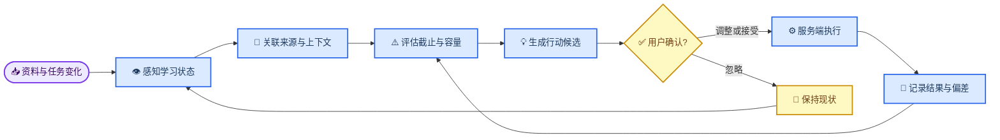

# 智能体创新实践大赛要求对照与产品开发方向

_方向调整日期：2026-08-22 · 最后核对：2026-09-02 · 当前阶段：M8 智能体能力增强 · 适用项目：学伴管家 · 中兴赛道命题四“学习 DDL 与资料管理智能体”_

---

## ✅ 当前判断

现有网站不仅覆盖资料入库、结构化标签、检索、DDL 抽取、人工确认、任务提醒、课表考试、复习计划和常用格式导出，也已经完成受控智能体行动、学习容量、跨来源证据导航与今日决策聚焦闭环；新增公开主页把“资料进入—DDL 确认—今日行动—复习调整”直接解释给大学生，邮箱账号把学习数据收进个人工作区，学期日程页则把课程时间和考试节点变成可查、可维护的校园事实，并能通过标准 iCalendar 文件预览确认后接入教务日历。前端以“学习台账”组织资料、日程、决策与行动，并提供默认简洁、可展开详细的双层信息密度。当前编号里程碑仍是 M8.30“多页面编辑保护与草稿恢复”，账号和学期日程扩展不虚构为新里程碑。普通学生先看下一行动；完整统计、管理、校准证据、复盘和历史位于详细台账，两层都不改变人工确认与服务端规则。

从当前代码看，资料上传后会自动运行本地规则并保存候选；任务已有预计/剩余用时；用户可设置学习容量、偏好时段和课程权重；首页 briefing 统一提供学习收件箱、七日/单日风险、最多 5 条今日决策、最多 3 条今日行动、容量候选和最近回执。默认首页不会把这些对象平铺成管理后台，而是按固定规则选出唯一主行动并保留高风险次级注意项；前端不生成新风险，也不把普通事项提升为紧急事项。补估时、开始任务和调整优先级都经用户确认后由服务端重验、幂等执行；复盘、提醒和行动的来源由服务端解析后可回到当前可用对象。系统能在真实完成反馈足够时解释学习节奏，并只在冻结窗口的版本、口径和样本门槛一致时做谨慎比较。详细视图继续展开证据、历史和高级配置，两种视图都不改变确认门禁。

因此，当前开发不进入技术报告、正式案例、视频和彩排收尾。方向调整为：**把网站从“带 AI 抽取的资料管理工具”升级为“能持续观察学习状态、提出有依据的行动建议、经用户确认后执行，并根据结果重新规划的学习智能体”**。比赛材料统一顺延至 M9。

## 🧭 产品定位

一句话定位：**学伴管家把分散的课程资料转成有来源、可确认、能执行、会调整的个人学习行动。**

产品不以通用聊天框为中心，也不让模型直接修改任务和日程。智能体价值体现在四点：

1. 主动发现：资料处理完成、新 DDL 出现、任务逾期或计划偏离时，系统能感知变化；
2. 有据判断：每条风险和建议都能说明来源、规则、截止时间与容量依据；
3. 受控行动：智能体只生成结构化行动候选，用户可接受、调整或忽略；
4. 持续调整：完成情况和实际耗时会影响后续排序与计划，而不是生成一次后静止不变。

## 📋 命题要求与开发升级

| 命题要求 | 当前基线 | M8 智能体化升级 |
| --- | --- | --- |
| 学生个人使用 | 邮箱注册登录、相互隔离的本地学习工作区、个人课表考试台账及教务 `.ics` 确认式接入 | 增加个人学习容量、偏好时段和课程权重；学习数据、课表考试、同步身份、上传文件和开发重置均按当前账号划分 |
| 资料入库 | 支持 PDF、DOCX、TXT、Markdown、图片和扫描 PDF | 建立“学习收件箱”，上传后自动完成本地解析、文件名与正文联合识别，并汇总待确认事项 |
| 结构化标签 | 支持课程、资料类型和标签，确认后落库 | 标签、课程和 DDL 作为同一批候选展示；课程、资料类型和标签明确标注来自文件名、正文、两者、规则推断或无法确认 |
| 资料检索 | 支持文件名、摘要、正文、标签和筛选 | 搜索结果进一步关联相关 DDL、复习计划和智能体建议，形成上下文而非孤立文件列表 |
| DDL 自动化 | 本地规则或按次选择外部 AI，输出候选后人工确认 | 资料处理事件自动触发本地候选；外部 AI 仍需主动授权，不在后台静默外发正文 |
| 提醒与任务闭环 | 近期、逾期、完成状态和 iCal 提醒 | 增加时间容量冲突、今日行动、临期风险和可确认的重排建议 |
| 复习清单 | 按课程资料和任务生成可编辑计划 | 新任务、任务完成、逾期和实际耗时变化后，生成“计划调整候选”，不直接覆盖人工计划 |
| 常用格式导出 | CSV、Markdown、iCal | 保留现有能力，当前不继续扩展导出格式 |
| 数据安全 | 默认本地处理、外部 Provider 按次选择、密钥不回显 | 智能体动作采用白名单、服务端校验、幂等执行和回执记录，模型不能输出任意操作参数 |

## 🔍 当前智能体缺口

| 当前行为 | 为什么还不够像智能体 | 目标行为 |
| --- | --- | --- |
| 上传后自动本地抽取，首页汇总待确认/需复核/失败资料，资料页提供按状态排序的逐资料确认队列（单份资料内可勾选多个候选一起确认） | 首页仍是摘要入口，资料页暂不支持跨资料批量确认或剪贴板/链接等新输入 | 保持受控来源和人工确认；只有后端补齐真实跨资料批量契约后再扩展，不用前端伪造 |
| 首页 briefing 已有服务端“今日三件事”、风险原因和回执；详细台账已提供近 7 天周度复盘、最多 3 项下周行动和可追溯来源 | 周度复盘仅在详细视图按需加载；历史只保留实际刷新过的北京时间窗口，缺失字段按未知/部分显示，不补造历史 | 继续积累真实窗口并提升复盘稳定性与可访问性，不以演示数据补造历史 |
| 已计算七日/单日容量、缺失估时和同日多 DDL，并形成近 7 天分级站内提醒、冻结的有限历史、本地摘要偏好和只读活动时间线 | 已支持冻结窗口比较，但需要真实关闭窗口累积后才有实际比较结果 | 持续积累真实冻结证据并加强稳定性、可访问性，不以演示数据补造历史 |
| 复习计划已支持事件差异与确认重排；周度复盘已按近 7 个中国本地日期统计计划项完成/延期，并携带计划项来源 | 无计划、计划内容不可读或相关样本不足时只能显示未知/部分，不能形成完整周期评价 | 继续用计划项和差异回执完善可追溯周度复盘；缺失数据明确降级，不补造结论 |
| 完成反馈已进入课程校准；近 28 日真实反馈可生成学习节奏信号和只读复核候选 | 课程校准结果尚未直接形成自动周期性学习建议，趋势不足时不能推断 | 样本充分时说明趋势，样本不足时只提示继续积累 |
| 建议生命周期已经持久化，已覆盖 `adjust_priority`、`set_task_estimate`、`start_task` 和 `apply_plan_delta`；计划差异可查询、重验并由用户确认后幂等应用 | 计划差异只作用于仍与快照一致、未完成且未人工修改的计划项；过期或冲突会失效，不自动覆盖人工计划 | 继续保持白名单、身份/版本与快照重验、幂等回执，继续积累真实历史并做可访问性验收 |

## 🤖 目标智能体闭环

这个闭环不是让系统无限自主运行，而是让它在明确事件发生时重新计算。任何会改变任务、计划或提醒的动作都必须经过用户确认，确认前只能保存为候选。

## 🖥️ 网站目标形态

首页从“统计仪表盘”升级为 **Agent Center（学习智能体中心）**，保留现有页面，但把用户每天最需要处理的内容集中到一个工作面。

| 区域 | 页面内容 | 主要交互 |
| --- | --- | --- |
| 学习收件箱 | 新资料、解析失败、待确认 DDL、缺失日期和冲突字段 | 查看来源、批量确认、修改、忽略 |
| 今日三件事 | 按截止风险、重要程度、预计用时和可用时间选出的最多 3 项行动 | 开始、调整时长、稍后处理 |
| 风险中心 | 容量不足、同日多 DDL、已逾期、计划偏离和待复核信息 | 查看计算依据、接受重排建议 |
| 智能体建议流 | 创建任务、调整优先级、安排学习块、重排计划等候选 | 接受、编辑后接受、忽略 |
| 执行回执 | 最近一次建议的执行结果、失败原因和受影响对象 | 跳转任务、资料或计划，必要时撤销可逆动作 |

网站的关键体验应是：用户上传一份资料后离开资料页，首页仍会主动显示“发现什么、为什么重要、建议做什么”；用户完成或推迟任务后，计划会提出新的安排，而不是要求用户重新从头生成。

## 🧱 智能体对象与动作边界

以下对象已经在 M8.1—M8.7 落地；后续继续复用，不另建平行对象。

| 对象 | 关键字段 | 责任 |
| --- | --- | --- |
| `StudyPreference` | 每周可用分钟、偏好时段、单日上限、缓冲比例、课程权重 | 保存可编辑的个人规划约束 |
| `AgentEvent` | 事件类型、实体类型、实体 ID、发生时间、处理状态 | 记录资料处理、任务变化和计划完成等触发源 |
| `AgentSuggestion` | 建议类型、原因码、说明、置信度、风险级别、来源引用、候选参数、状态 | 承载可解释、可确认的结构化行动 |
| `AgentRun` | 触发事件、规则版本、输入快照、建议 ID、运行状态 | 让每轮判断可追溯和可复现 |
| `ActionReceipt` | 建议 ID、执行动作、受影响对象、执行结果、失败原因、时间 | 证明服务端实际执行结果，避免只显示成功文案 |
| `SourceNavigation`（响应契约） | 来源类型、来源 ID、当前可用性、固定站内目标、提示 | 将历史证据与当前对象解析分离；来源删除时不猜测替代目标 |

当前可执行白名单包括 `adjust_priority`、`set_task_estimate`、`start_task`、`complete_task`、`reset_course_calibration` 和 `apply_plan_delta`；`review_daily_overload`、`navigate_same_day_deadlines` 及后续纯提醒只导航或提示人工复核。模型或前端不能提交任意数据库字段、自由 SQL、文件路径或未定义动作。

## 🚀 M8 开发优先级

| 优先级 | 开发项 | 完成后的产品变化 | 验收边界 |
| --- | --- | --- | --- |
| P0-1 | 智能体事件、建议、运行记录和执行回执 | 建议从一句文案变成可追溯的产品对象 | 建议可生成、查询、接受、修改、忽略和失效；重复接受不重复执行 |
| P0-2 | 学习收件箱与自动本地抽取 | 上传资料后自动出现待确认事项 | 默认只运行本地规则；文件名与正文联合抽取；外部 AI 不自动调用 |
| P0-3 | 学习容量与任务工作量 | 系统能判断“来不来得及” | 任务支持预计/剩余用时；用户能设置每周可用时间；缺失数据时明确提示 |
| P0-4 | 今日三件事与风险中心 | 首页能主动告诉用户现在最值得做什么 | 最多 3 项；每项有原因、来源、预计用时和风险；排序由服务端生成 |
| P0-5 | 确认后执行与回执 | 智能体建议真正进入任务和计划闭环 | 服务端重新校验权限、状态和参数；失败不产生部分写入 |
| P1-1 | 事件驱动的计划重排 | 新 DDL、逾期或提前完成后可以调整后续计划 | 只生成差异候选；不覆盖已完成人工编辑；接受后记录前后快照 |
| P1-2 | 完成反馈与估时校准 | 智能体能根据个人真实节奏改善后续建议 | 实际用时为可选输入；按课程渐进校准；用户可重置学习记录 |
| P1-3 | 周度回顾 | 展示本周完成、偏差、下周风险和可操作建议 | 数据来自本地任务与计划，不生成无法追溯的评价 |
| P2 | 有边界的对话入口 | 用户可用自然语言查询状态或请求生成候选动作 | 对话只能调用已定义的查询和候选动作；不能绕过确认门禁 |

P0 按表中顺序实施。P1 只有在 P0 的建议生命周期稳定后进入；P2 对话入口不是“智能体”的前置条件，也不能替代 Agent Center。

## 🛡️ 智能体安全边界

1. 模型只产生结构化候选，不直接写数据库；服务端拥有最终解释、校验和执行权；
2. 每条建议必须携带来源对象、原因码和生成时间，无来源的重要动作默认要求复核；
3. 用户接受前再次校验对象是否仍存在、任务状态是否变化、建议是否过期；
4. 执行使用幂等键，重复点击或网络重试不能重复创建任务和计划项；
5. 计划重排只修改用户确认的项目，已完成内容和人工锁定内容不可覆盖；
6. 外部 AI 保持按次选择和正文外发前确认，后台事件不得自动触发外部调用；
7. 当前是带邮箱账号和本地工作区隔离的开发版；不因已有登录就宣称公网生产、高并发租户、邮箱所有权验证或外部消息推送已经完成。

## 🎯 M8 分步路线

| 子阶段 | 当前目标 | 完成标志 |
| --- | --- | --- |
| M8.1（已完成） | 建立 `AgentEvent`、`AgentSuggestion`、`AgentRun`、`ActionReceipt` 契约和最小 API | 首页已读取真实建议；状态流转和幂等执行已有自动化测试与 HTTP 实测 |
| M8.2（已完成） | 建立学习收件箱、文件名联合抽取、学习偏好和工作量字段 | 上传后自动产生本地候选；容量可配置；七日/单日风险有计算依据 |
| M8.3（已完成） | 上线今日三件事、风险中心和受控动作执行 | 服务端排序、容量候选、课程权重、真实页面点击和幂等回执均已验证 |
| M8.4（已完成） | 上线事件驱动的计划重排和完成反馈 | 四类变化产生可确认差异；人工/完成项受保护；校准、重验与回执已验证 |
| M8.5（已完成） | 上线周度复盘与分级站内提醒 | 最近 7 天的完成、偏差和风险形成可解释复盘；有限下周行动、来源导航及持久忽略已验证 |
| M8.6（已完成） | 增强复盘历史与提醒偏好 | 冻结有界真实历史；提醒偏好、高风险保护、站内摘要节奏与隐私大小边界均已落地 |
| M8.7（已完成） | 增强跨来源证据导航与可访问性 | 服务端白名单解析来源；前端安全消费深链；来源删除时保留历史证据并提示不可用；任务证据与 375px 页面已实测 |
| M8.8（已完成） | 学习节奏趋势与受控调整 | 只用最近 28 个本地日内真实完成反馈生成四项节奏信号；缺失不补值；候选固定为复核且没有写入端点 |
| M8.9（已完成） | 学习节奏历史与谨慎比较 | 节奏摘要仅随当前窗口保存、关闭后冻结；只比较相同版本/口径且样本足够的两条关闭快照，其他情况明确不可比 |
| M8.10（已完成） | 智能体活动与过程可解释 | 已持久化的事件、建议、回执和运行记录投影为受限只读时间线；不暴露内部载荷，来源仍由服务端白名单解析 |
| M8.11（已完成） | 资料确认到 DDL 的审计闭环 | 用户确认资料识别并创建正式任务时，事件与任务同事务落库；时间线仅呈现固定解释和资料来源，不暴露候选、批次或路径 |
| M8.12（已完成） | 结构化字段来源解释 | 课程、资料类型和每个标签的证据只由服务端从文件名与正文重建；有界摘录不包含路径或 URL，用户修订后不误用原证据 |
| M8.13（已完成） | 今日决策台与可审美的行动聚焦 | 从资料、计划建议和容量风险中提炼最多 5 条有界只读决策；固定排序、最小来源和 resolver 导航保留用户确认边界，首页以“来源 → 决策”突出下一步 |
| M8.14（已完成） | 学习台账前端与资料闭环可见化 | 用“资料 → 决策 → 行动”统一网站导航和视觉层级；资料页按真实状态展示“入库—识别—人工确认”，让智能体感知和用户确认边界在桌面与移动端都可见 |
| M8.15（已完成） | 核心页面围绕学生任务重排 | 首页成为今日决策索引，任务页先展示行动状态，计划页呈现真实编排顺序，设置页成为规则簿；减少无关面板竞争，让评委一眼看到智能体如何感知、判断和交还确认权 |
| M8.16（已完成） | 面向普通大学生的双层信息密度 | 默认简洁视图只保留关键行动、风险与确认入口，详细视图承载证据、历史、完整筛选和高级配置；高风险事实不因简化隐藏，模式跨页面保持并完成桌面、手机和横屏实测 |
| M8.17（已完成） | 可访问操作与渐进设置 | 路由 `path` 变化聚焦 `main`，skip link 显式聚焦且同页 hash 不受影响；设置四块摘要按需进入详细区块并聚焦，支持 reduced motion；任务/资料卡片分主次操作，移动底栏安全区、移动端 16px 输入与警告/灰文对比度已补齐 |
| M8.18（已完成） | 第一轮学习闭环与真实空状态 | 首页用真实计数显示课程—资料—任务—完成四步，简洁视图只给当前一步、详细视图给证据；固定 action 直达真实操作，已完成任务可更新反馈，读取失败不显示假零或旧数据 |
| M8.19（已完成） | 今日行动舞台与渐进详细台账 | 首页把真实 briefing 收敛为唯一主行动和次级高风险注意项；简洁视图移除完整管理台竞争，详细视图保留全部证据、历史和确认门禁；多来源可展开且只经服务端 resolver 导航 |
| M8.20（已完成） | 渐进数据加载与前端性能预算 | 简洁首页只加载主行动所需事实，详细资源首次进入详细视图再读取且重复切换不重取；组件样式白名单将入口 CSS gzip 降低约 46%，构建预算阻止包体回退 |
| M8.21（已完成） | 复盘卷宗与移动可访问性 | 详细视图将活动、复盘、节奏、趋势和提醒按需创建在可访问卷宗中，行动与确认门禁保持直接可见；移动底栏按真实高度为内容、焦点与安全区预留空间 |
| M8.22（已完成） | 阅读清晰度、长内容韧性与行动轨迹 | 关键课程/资料/任务/计划/来源/错误不再截断；首页用静态“事实 → 判断 → 行动”解释智能体闭环，仍由服务端决定事实、由用户触发行动；五页完成手机与横屏长文本验证 |
| M8.23（已完成） | 可见学习流与行动优先首页 | 简洁首页用真实七日任务时间带、AI 资料收件台和首轮闭环承接唯一主行动；管理统计退入详细视图，固定站内入口、真实空状态和横竖屏已验证 |
| M8.24（已完成） | DDL 时间议程与任务行动层 | 简洁任务页用真实本地时间将 DDL 排为可执行议程，NOW 分开逾期与未来；风险不只靠颜色，完整管理能力留在详细视图，七组、深链、交互和三种视口已验证 |
| M8.25（已完成） | AI 资料收件台与确认优先层 | 简洁资料页按真实处理/识别状态形成最多 6 项确认优先队列，每项只有一个主动作；无正文、加载失败和深链都有恢复/聚焦，详细管理保留全量能力，取消候选不再阻塞确认 |
| M8.26（已完成） | 近期复习行动板与计划执行层 | 简洁计划页给出真实下一项和最多 7 条近期日程；完成不乐观更新且不提交未保存编辑，跨计划延期与深链可用 |
| M8.27（已完成） | DDL 学习资料包与安全来源回路 | 任务页将直接关联资料放在行动旁；可用、删除、未关联诚实区分，点击经服务端解析与严格前端校验 |
| M8.28（已完成） | 首页 DDL 资料就绪带与共享安全导航 | 同一关系前置到简洁首页，异常状态不造入口；安全校验共享并纳入自动化，手机连接状态保持可见 |
| M8.29（已完成） | 不可复用来源身份与端到端导航保护 | 资料、DDL、计划及回执使用稳定身份；同号替代不可冒用旧导航、旧建议或导出名称，旧库历史安全降级 |
| M8.30（已完成） | 多页面编辑保护与草稿恢复 | 网站核对打开时的身份和版本；过期操作不覆盖新内容，草稿保留且恢复入口在活动弹窗内，预览同时核对来源归属 |
| 2026-09-01 开发扩展（已完成，非新里程碑） | 公开主页与邮箱账号 | 大学生可先理解智能体闭环再注册；登录后进入个人学习工作区，业务 API、写操作和实例级配置均有明确边界 |

### M8.17“可访问操作与渐进设置”验证记录

2026-08-28 在隔离 SQLite 的真实本地页面上重点复核总览、资料、任务和设置：1440×1000、375×840、840×375 均无页面级横向溢出，触控区不小于 44px，移动端输入字号为 16px，底栏不遮挡内容；路由、同页 hash、skip-link、设置展开、任务/资料操作分组均已验证，控制台无错误。复习计划本轮完成样式审查、lint 与 production build，不追加页面实测结论。资料识别入口只在处理状态为 `processed` 且存在 `extracted_text` 时显示；高风险提醒和外部 AI 按次授权/正文可能外传边界始终可见。浏览器大字号快捷键未生效，本轮未将其计为已实测。

前端 `npm run lint` 和 `npm run build` 通过，构建仅保留既有 `@vueuse` PURE annotation 警告。后端测试本轮未重跑，150 项仍为 M8.13 既有基线，不作为本轮新增通过证据。

### M8.18“第一轮学习闭环与真实空状态”验证记录

2026-08-28 使用隔离空库与已有数据副本验证：首页分别显示真实 0/4、3/4 和完成后的 4/4；简洁/详细信息密度、隐藏/恢复、课程/资料/任务操作直达、复习计划无课程恢复路径均可用。已有数据副本中的任务先记录 75 分钟完成反馈，再从已完成入口更新为 90 分钟，最终 API 返回 `completed` 与 `actual_minutes=90`。后端断开时统计退回“—/待补充”、待确认数显示“—”，只保留一条页面连接错误和可重试状态。空库在 375×840 与 840×375 下无页面级横向溢出，闭环操作高度为 44px；正常已有数据闭环控制台无错误。

本轮前端 lint/build 与前端差异检查通过，build 仅保留既有 `@vueuse` PURE annotation 警告；后端只运行 M8.4 的 7 项和 M8.7 的 6 项定向测试，共 13 项通过。150 项完整测试仍为 M8.13 既有基线，本轮未重跑。

### M8.19“今日行动舞台与渐进详细台账”验证记录

2026-08-29 使用现有数据、隔离空库和受控后端断连验证：已有数据时首页只突出一个高风险任务主行动，其余待确认资料作为次级注意项；主行动经服务端 resolver 安全定位到真实任务，进入详细台账后焦点落到完整 Agent Center。空库显示真实 0、首轮进度 0/4 和“没有需要优先处理的事项”，不出现演示行动；断连时旧行动被清除、统计退为“—”，页面明确不会用旧数据或猜测替代，恢复后真实行动重新出现。

桌面、375×840 和 840×375 均无页面级横向溢出，主行动、来源展开和横屏连接重试控件不小于 44px；多来源列表可展开/收起，目标仍只接受服务端 resolver 的站内白名单。前端 lint/build 与差异检查通过，build 仅保留既有 `@vueuse` PURE annotation 警告；后端仅运行 M8.7 的 6 项定向测试。150 项完整测试仍为 M8.13 既有基线，真实屏幕阅读器人工验收与详细台账组件拆分继续留在 M8。

### M8.20“渐进数据加载与前端性能预算”验证记录

2026-08-29 使用现有数据副本和独立服务端日志验证：简洁首页首次进入只请求 Dashboard 与智能体 refresh，共 2 个业务请求；周度复盘/历史、趋势、冻结比较、活动、计划差异和来源解析仅在进入详细视图后加载。首次详细加载完成后，切回简洁再进入详细视图没有新增请求；手动刷新建议会重新读取完整详细资源。详细服务断开时页面逐项说明失败范围、保留主行动且不显示旧活动。

Element Plus 全量样式已替换为当前组件及浮层服务白名单，全局 CSS 从 369.79 kB / gzip 50.93 kB 降至 193.43 kB / gzip 27.53 kB。任务弹窗、遮罩、输入、主按钮、选择下拉、375×840 和 840×375 均完成真页面烟测；`npm run verify` 覆盖 lint、production build 和四项 gzip 预算。M8.7 定向测试 6 项通过，150 项完整后端基线未重跑，真实屏幕阅读器人工验收仍留在 M8。

### M8.21“复盘卷宗与移动可访问性”验证记录

2026-08-29 使用现有数据验证：详细台账的当前判断、收件箱、今日行动、容量、最近回执及计划差异/建议仍直接可见；活动时间线、周度复盘与历史、节奏比较、学习趋势和提醒默认进入“复盘与学习节奏”卷宗。关闭时页面不创建其中的 40 个活动节点，桌面详细页高度由约 10,983px 降为约 3,630px；展开后恢复完整 40 条记录。卷宗使用原生按钮、稳定 ID、`aria-expanded`、`aria-controls` 与有标签 region，未改变任何执行权限或来源导航规则。

375×840 与 840×375 均无页面级横向溢出；固定底栏将实测 74px 高度同步到内容留白、滚动留白和 safe-area，五个链接约 62.7px，视图按钮为 44px，末尾操作未被遮挡。`npm run verify` 和前端差异检查通过，build 仅保留既有 `@vueuse` PURE annotation 警告。M8.21 未改后端且未重跑后端测试；真实屏幕阅读器、实体键盘和系统级大字号人工验收仍留在 M8，不计为已通过。

### M8.22“阅读清晰度、长内容韧性与行动轨迹”验证记录

2026-08-29 对附加创意设计稿做了批判性收敛：采纳 Calm Academic 底盘、No-Chat Agent、Next Best Action 与 AI Thread 的核心判断，但只把 AI Thread 落成静态“事实—判断—行动”解释层；不采用 3D、DDL 星图、压力天气、全局玻璃态、复杂脉冲动画或生成式布局，因为当前阶段更需要稳定、清晰、可复核的真实产品。该轨迹只说明“真实数据—当前一步—由你触发”，不展示模型思维链、不产生新优先级、不绕过确认门禁。

隔离 SQLite 使用超长课程、资料、任务和计划名称验证总览、资料、任务、计划、设置五页；375×840 与 840×375 下页面 `scrollWidth` 均等于 `clientWidth`，关键文本完整换行，复习计划横屏小型步进按钮隐藏且输入区保持 44px。`npm run verify` 通过，gzip 实测为入口 CSS 26.97 KiB、Dashboard JS 35.96 KiB、Dashboard CSS 7.86 KiB、最大 JS 114.97 KiB；build 仅保留既有 `@vueuse` PURE annotation 警告。M8.22 未改后端且未重跑后端测试；150 项完整测试仍为 M8.13 既有基线。

### M8.23“可见学习流与行动优先首页”验证记录

2026-08-29 继续对附加创意设计稿做批判性吸收：采纳 Deadline Flow 和 AI Inbox 的“时间距离 + 资料入口”价值，但改成与既有 Calm Academic 学习台账一致的静态时间带和紧凑收件台；不引入雷达、星图、压力天气、漂浮自由布局或脉冲动画。这一取舍使首页更契合“学习 DDL 与资料管理智能体”：学生首先看当前行动，然后看七日 DDL 距离和待确认资料，而不是先看管理统计。

隔离 SQLite 注入超长课程名与 12 小时、2 天、5 天三个截止任务，并额外放入已过期及 7 天外样例。真实契约验收发现并修复了后端 6 位微秒 ISO 时间被前端毫秒解析器过滤的问题；三个任务最终进入正确时间带，边界外项不显示。375×840、840×375 和 1440×1000 无页面级横向溢出，窄屏操作不小于 44px，长文本完整换行，桌面两栏对齐，控制台无错误。任务深链、资料上传对话框、当前收件箱视图与简洁/详细分层已实测。`npm run verify` 通过，gzip 实测为入口 CSS 26.97 KiB、Dashboard JS 39.69 KiB、Dashboard CSS 9.06 KiB、最大 JS 115.00 KiB；Dashboard CSS 上限由 8 KiB 有依据地调整为 10 KiB，JS 上限保持 42 KiB。M8.23 未改后端且未重跑后端测试；150 项完整测试仍为 M8.13 既有基线。

### M8.24“DDL 时间议程与任务行动层”验证记录

2026-08-29 继续对附加创意设计稿做批判性收敛：采纳 Timeline/Agenda、Timeline First、NOW Line 和“风险不能只靠颜色”的原则，落成与 Calm Academic 学习台账一致的静态纵向议程；不采用月历、雷达重复、DDL Crossing 动效或新的前端风险模型。这样既让 DDL 成为比赛名称下的核心行动界面，又不让视觉概念越过服务端事实与用户确认边界。

隔离 SQLite 注入 14 项任务，覆盖已逾期、今天、明天、未来 7 天、稍后、未定日期和已完成，包含六位微秒 ISO、超长课程名和真实完成用时。NOW 位于逾期与未来组之间；完成、反馈、编辑、进入详细管理后的焦点、`task_id` 深链和详细行高亮均实测，12 项直显上限会诚实提示“另有 2 项”。375×840、840×375 和 1440×1000 无页面级横向溢出，长文本完整换行，直接操作不小于 44px，控制台无错误。`npm run verify` 通过，gzip 实测为入口 CSS 26.97 KiB、Dashboard JS 39.69 KiB、Dashboard CSS 9.06 KiB、Tasks JS 15.16 KiB、Tasks CSS 3.39 KiB、最大 JS 115.00 KiB；新增 Tasks JS/CSS 18/5 KiB 上限。M8.24 未改后端且未重跑后端测试；150 项完整测试仍为 M8.13 既有基线。

### M8.25“AI 资料收件台与确认优先层”验证记录

2026-08-30 对设计稿的 AI Inbox 与 AI Extracted 卡片做了批判性吸收：采纳“先给下一步、识别结果必须确认、错误可恢复、详细证据按需展开”，落成与既有学习台账一致的确认优先队列；不采用假扫描阶段、假置信度、聊天框、资料级紧急度推断、Used/Reviewed/Archived 生命周期或前端拼装的新来源证据，因为当前 API 不提供这些事实。

隔离 SQLite 覆盖处理失败、需复核、待确认、识别失败、未识别、处理中、待处理和已确认 8 种资料状态，并验证超长文本、6 项截断、搜索空状态、无正文详情直达编辑、服务断开/恢复、`material_id` 深链、`view=current_inbox` 与双候选确认。取消一条候选并清空其名称后，页面只提交已勾选项并成功创建 1 条任务。375×840、840×375 和 1440×1000 无页面级横向溢出，主要按钮与移动候选输入不小于 44px，最终健康页面控制台无错误。`npm run verify` 通过，Materials JS/CSS 实测 19.57/3.79 KiB gzip，低于新增 24/5 KiB 预算。M8.25 未改后端且未重跑后端测试；150 项完整测试仍为 M8.13 既有基线。

### M8.26“近期复习行动板与计划执行层”验证记录

2026-08-30 对设计稿的 Next Best Action、Human Review Queue、Ghost Suggestions 与 Context Pack 做了批判性吸收：本轮只采纳“先给当前行动、详细依据按需展开、建议不得静默执行”的产品原则，落成基于既有计划事实的近期复习行动板；不采用假 AI 计划、准备度、风险分、优先级、置信度或未落库的 Ghost Suggestion。界面明确使用“近期”而非“本周”，因为显示上限是最多 7 条计划记录，不是自然周事实。

简洁视图按已延期、今天、未来 6 个本地日期和稍后选出下一项，保留最多 7 条与剩余数量；详细视图继续提供生成、校准、导出、归档、来源和完整编辑。完成动作在服务端成功前不改变页面，只提交最近一次已保存计划项基线，避免把未保存编辑一并写入；失败会保留原状态。`plan_id/item_id` 会真实聚焦，`weekly_plan_delays` 汇总全部未归档计划最近 7 个中国本地日期的未完成历史项，无课程归属计划也可直接打开。隔离 SQLite 覆盖跨计划延期、10 项截断、远期深链、完成成功/断连、未保存编辑隔离和无课程计划；375×840 与 840×375 无页面级横向溢出，最多 7 张卡片，按钮最小 44px，最终健康页无控制台警告或错误。`npm run verify` 通过，StudyPlans JS/CSS 实测 13.80/4.50 KiB gzip，低于新增 16/6 KiB 预算。M8.26 未改后端且未重跑后端测试；150 项完整测试仍为 M8.13 既有基线，跨标签版本冲突、真实屏幕阅读器、实体键盘和系统级大字号仍待后续 M8 验收。

### M8.27“DDL 学习资料包与安全来源回路”验证记录

2026-08-31 对设计参考中的 DDL ↔ Related Resources 做了批判性吸收：采纳“学生准备开始 DDL 时应直接看到已关联资料”的核心关系，但只使用任务已保存的 `material_id` 和当前资料列表，不采用同课程推荐、AI 相似度、知识图谱、聊天入口或虚构 Context Pack。可用资料显示真实文件名和“打开资料”；资料删除后只保留历史名称且没有失效按钮；从未关联的任务明确提示可在编辑时选择资料。

打开动作统一调用服务端 resolver，前端严格核对来源身份、可用性、固定 `/materials` 路径和唯一匹配的 `material_id` 查询后才跳转；断连、畸形响应、额外参数、任意路径或外链都不会执行。隔离 SQLite 覆盖可用、已删除、未关联、长文件名、简洁/详细入口和服务失败：可用资料真实进入 `/materials?material_id=1`，断连时明确报错并留在任务页；375×840 与 840×375 无页面级横向溢出，按钮不小于 44px，健康页无控制台警告或错误。`npm run verify` 通过，Tasks JS/CSS 实测 16.14/3.70 KiB gzip，低于 18/5 KiB 预算；M8.7 证据导航 6 项聚焦测试通过，150 项完整测试仍为 M8.13 既有基线且未重跑。设置页另去除简洁状态重复文案并补充课程逐项操作名称，不改变比赛功能边界。

### M8.28“首页 DDL 资料就绪带与共享安全导航”验证记录

2026-08-31 继续采纳设计参考中 DDL ↔ Related Resources 的核心关系，但不新增推荐分、知识图谱、聊天框或第二套资料数据源。首页七日截止卡直接复用 Dashboard 已有字段，给出可用、历史删除、未关联和矛盾四态；只有可验证的当前资料才显示打开按钮。任务和资料按钮同级，窄容器自动收敛列数，完整管理仍在详细视图。

Dashboard 与任务页共享严格资料目标校验，新增 `navigation:check` 随 `verify` 检查四态、异常编号和恶意/畸形目标。真实隔离页面验证了资料/任务深链、点击前删除、服务断开、长文件名、手机在线/离线状态与双视图；1440×1000、375×840、840×375 无页面级横向溢出，新增按钮为 44px、无嵌套控件，健康页面无控制台警告或错误。矛盾数据为自动化验证，未伪造浏览器服务端响应。`npm run verify` 与 M8.7 的 6 项聚焦测试通过，Dashboard JS/CSS 为 40.34/9.17 KiB gzip，未提高预算；本轮未改后端业务，150 项完整基线未重跑。

本轮还确认一项必须继续开发的可信来源缺口：删除后复用数据库编号，会让旧页面或历史来源被解析为同号新对象，也可能使旧计划导出取得错误资料名。站内导航白名单不能解决对象身份问题；下一优先项是不可复用来源身份、旧库兼容迁移及旧引用安全降级。本轮尚未修复，不能将 M8.28 的界面和导航校验完成解释为全部历史来源安全已验收。

### M8.29“不可复用来源身份与端到端导航保护”验证记录

本轮关闭上述 M8.28 发现的来源归属缺口。设计参考中的 Related Resources、证据按需查看和 Human Review 原则继续保留，但“有入口”必须意味着来源可验证，而不是同号数据还存在。服务端为资料、任务、计划、计划项与回执持久化独立身份；解析成功后，目标页面再次校验，旧来源失效时用简明提示与清除定位动作承接，不让学生误操作替代计划。

旧库升级只给当前实体补身份，不能据同号新行猜测历史来源；缺少身份的旧建议失效，旧证据继续展示但不能跳转。旧计划导出保留原文快照，并明确区分“历史来源未验证”与“来源已失效”，不会替换为新资料名称。这强化的是命题四资料与学习行动之间的可信关系，并非新增聊天框、伪造证据或扩大自动执行权限。

完整后端 159 项测试及前端 `npm run verify` 通过，现有性能预算不变。隔离 SQLite 真实页面复现资料/任务编号复用与计划项删除重添：旧资料按钮留在原页，旧深链不打开新对象；失效计划在简洁/详细视图中都没有完成、保存或导出入口，清除定位后恢复普通管理。用户真实数据库尚未迁移，公网部署、跨标签编辑版本冲突和真实辅助技术验收仍未完成；完整证据见[开发进度](../quality/开发进度.md)，契约与兼容边界见[架构与技术路线](./架构与技术路线.md)。

### M8.30“多页面编辑保护与草稿恢复”验证记录

批判性吸收设计参考中的“失败可恢复”和 Human Review：人工确认不仅要点击一次，还必须确认仍是刚才看到的资料和状态。本轮不实施 Academic Git 式完整历史，而是先解决真实的多页面覆盖：任务、资料和计划操作携带已读身份与版本；过期保存、完成、归档或资料确认由服务端拒绝，当前草稿继续保留。提示卡只出现在活动弹窗或当前页面，最新字段按需展开，用户明确放弃后才重读，切换对象不携带上一对象的冲突提示。

资料预览另外验证其归属，旧列表不能在读取同编号替代资料时悄悄换成新身份；缺少可验证信息时停止应用预览。已删除资料显示明确的不存在提示，不误写成普通更新。默认简洁/详细视图、按次外部 AI 授权和正式任务人工确认边界均保留。

完整后端 183 项测试和前端 `verify` 通过，体积预算不变。隔离页面验证双任务页先后保存、查看最新不覆盖草稿、取消放弃与明确重读；验证过期正文无新任务、重新识别后正常确认；验证计划过期保存/完成/归档以及重读后完成成功。375×840 任务/资料恢复弹窗和 840×375 计划页无页面级横向溢出，恢复按钮为 44px。详细证据见[开发进度](../quality/开发进度.md)。

该保护针对当前网站接入的逐实体操作，旧 API 无版本请求仍兼容；不承诺刷新后草稿恢复、自动合并、完整版本历史、公网高并发或慢模型请求并发吞吐。真实库升级、真实历史与辅助技术验收继续留在 M8。M8.29 中记录的跨标签编辑缺口由本轮接续，不改写其他历史验收结论。

### 2026-09-01“公开主页与邮箱账号”开发扩展验证记录

本轮围绕“学习 DDL 与资料管理智能体”的名称补齐完整产品入口，而不是增加通用聊天或案例包装。公开主页用本周课表式台账呈现真实产品关系：资料进入后先识别、DDL 经人工确认、智能体给出有来源的下一行动、完成反馈再影响计划。注册登录页与学习工作区采用同一校园台账视觉语言，并在 375×840 下保证首屏 CTA、完整表单、16px 输入和无页面级横向溢出。

后端新增独立账号库、随机盐 `scrypt` 密码哈希、HttpOnly Cookie 会话、CSRF 校验、统一业务 API 鉴权和首账号管理员边界。第一个账号兼容接管现有业务库，后续账号使用独立 SQLite 工作区和上传目录；开发重置只影响当前账号。完整后端 `187 passed, 1 warning`，前端 `npm run verify` 通过；隔离真页面走通注册/登录、移动账号卡、新增课程、退出和受保护路由回跳。

本轮没有修改实际用户库，也没有发送真实邮件或验证公网。邮箱验证、密码恢复、登录限流、备份恢复、静态加密与运维审计仍未实现；本地 SQLite 文件隔离不能表述为成熟的高并发租户平台。

### 2026-09-01“课表与考试”开发扩展验证记录

本轮继续围绕大学生日常学习场景增强网站，而不是转向案例包装。新增 `/schedule` 学期日程页：桌面按七天展示课程票根，手机按天切换；课程支持第 1—30 周、起止周、每周/单双周、上下课时间、地点与备注，真正共享有效周次且时间重叠时由服务端拒绝。考试支持类型、起止时间、考场、座位、备注、倒计时和历史开关，统一按北京时间展示。

课表与考试复用现有课程，并继续保存在当前邮箱账号的独立学习工作区；身份、版本与 `If-Match` 防止旧页面覆盖。完整后端为 `191 passed, 1 warning`，前端 `npm run verify` 通过；隔离浏览器验证七日课表、单双周筛选、考试时间与弹窗、375×840 按天视图、六项移动导航和无横向溢出，健康页面控制台无警告。

当前周次仍由用户选择，没有根据学期开学日自动计算；该轮也没有让课表或考试自动生成 DDL、修改智能体容量/复习计划、导出 iCal 或连接学校教务系统。它补齐的是“学习 DDL 与资料管理智能体”所需的校园时间上下文和真实使用入口，不扩大自动执行权限。

### 2026-09-01“教务日历只读接入”开发扩展验证记录

本轮在上述学期日程基础上新增标准 iCalendar 适配器，而不是收集学生的教务密码或伪装成已经适配所有学校。用户选择教务系统导出的 `.ics`，填写学期第一周日期和周数，服务端先把每周/隔周事件换算为课表周次，并识别考试、北京时间和地点；前端只在逐项勾选并确认后写入。

重复同步通过来源散列、外部 UID、本地不可复用身份和上次应用内容散列区分新增、更新、无变化与冲突。学生在本地改过的内容不会被覆盖，已删除目标不会自动恢复，远端缺失不会删除本地记录，课表时间冲突继续由服务端拒绝。数据库不保存原始日历、账号密码或长期订阅地址。

完整后端为 `197 passed, 1 warning`，前端 `npm run verify` 通过。隔离真页面从无课程账号完成“选择 `.ics`—预览 2 节课程和 1 场考试—确认同步—回到七日课表”；南理工专用入口另以合成 HTML 和模拟会话验证解析、短时凭据策略与防回显，不使用真实学号密码。主课表与按需接入面板 JS/CSS 均有独立 gzip 上限。

当前可表述为“支持标准教务日历文件与南京理工大学本机一次性接入”，不能表述为“已直连任意学校教务系统”或“获得学校官方授权”。南理工旧教务使用 HTTP，页面明确提示风险且不保存凭据；其他学校的 CAS、统一身份认证、验证码或私有 API 仍需按学校单独开发。

M8 完成后，网站应当在没有通用聊天框的情况下也能清楚体现“感知—判断—建议—确认—执行—反馈”的智能体闭环，并允许普通大学生先看结论与下一步、评委或高级用户再展开证据和历史。M9 再处理正式案例、技术报告、视频、彩排和最终提交包。
