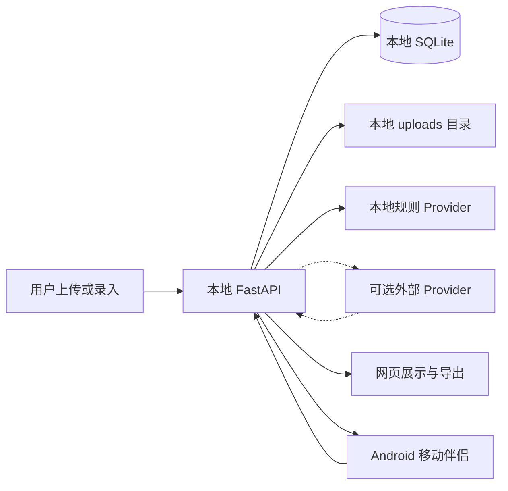

# 学伴管家合规与隐私说明

_面向比赛评审和本地演示的内部说明；不构成法律意见，最后核对日期：2026-09-02_

---

## 🧭 适用范围

当前版本是带邮箱账号的本地学习管理工具，默认使用 SQLite 和本地文件目录保存数据。账号、会话与学习数据已分层：第一个账号接管原有本地工作区，后续账号使用独立数据库和上传子目录；系统仍没有邮箱验证、找回密码、云端同步或生产级账号运维，因此不应把当前版本当作面向公众的生产服务。

## 📦 数据处理范围

| 数据类别 | 可能内容 | 默认存储位置 | 演示处理原则 |
| --- | --- | --- | --- |
| 账号与会话 | 邮箱、称呼、密码哈希、会话 token 哈希 | `data/auth.db` | 只使用专用演示邮箱与密码 |
| 课程信息 | 课程名、教师、学期、颜色 | `data/app.db` 或 `data/users/<workspace>.db` | 使用虚构或脱敏内容 |
| 资料元数据 | 文件名、类型、标签、摘要、处理状态 | 当前账号工作区数据库 | 不使用私人文件名 |
| 资料正文 | TXT、Markdown、PDF、DOCX 或 OCR 文本 | 当前账号工作区数据库 | 只使用公开或脱敏样本 |
| 原始文件 | 上传资料的本地副本 | `data/uploads/` 下的账号目录 | 演示后清理或使用测试数据重置 |
| DDL 任务 | 任务名、截止时间、来源片段、状态 | 当前账号工作区数据库 | 使用虚构课程任务 |
| 复习计划 | 计划日期、主题、时长、来源 ID | 当前账号工作区数据库 | 不包含个人身份信息 |
| 教务连接凭据 | 南理工学号、密码、验证码和短时 Cookie | 仅本机进程内存；一次请求或最长 5 分钟 | 不写数据库、文件、日志或浏览器存储；用后关闭会话 |
| 教务同步结果 | 课程、教师、周次、教室、考试时间/座位和外部项目身份 | 当前账号工作区数据库 | 预览勾选后才保存；不保留原始 HTML |
| Android 移动会话 | 平台邮箱登录密码、session Cookie、CSRF | 密码仅用于一次请求；Cookie 仅在应用进程内存 | 不写偏好、文件或日志；退出/进程结束后清除 |
| Android 移动偏好 | 学习服务地址、当前教学周 | 应用私有 `SharedPreferences` | 不保存邮箱、密码、教务凭据或原始资料 |
| 外部模型请求 | 仅在配置并主动选择外部 Provider 时发送文件名和抽取文本 | 外部 Provider | 默认本地；外发前显示范围并二次确认 |

## 🔐 数据流和边界

默认配置下，抽取使用本地规则 Provider，不需要网络和 API 密钥。API Key 可以通过设置页保存到项目根目录 `.env`，也可以手动编辑 `.env`；设置接口和页面永远不返回完整密钥，只返回是否配置及首尾掩码。只有同时配置 `LLM_API_KEY`、`LLM_MODEL`，并由用户在单次抽取中选择“外部 AI API”和确认隐私提示后，才会发送文件名与解析正文。外部 Provider 的可用性、隐私政策和数据留存规则由使用者自行确认。

## 🌐 外部服务披露

| 场景 | 是否默认启用 | 可能发送的数据 | 使用前要求 |
| --- | --- | --- | --- |
| 本地规则 Provider | 是 | 不离开本机的资料正文 | 无网络或密钥要求 |
| OpenAI-compatible Provider | 否 | 用于抽取的资料文本及必要上下文 | 配置密钥前确认服务条款、区域和留存策略 |
| OCR 组件 | 按文件类型触发 | 图片或扫描 PDF 的本地内容 | 优先使用本地 OCR；失败后保留原因 |
| 南京理工大学旧教务系统 | 仅用户主动接入时 | 学号、密码、验证码；读取课表与考试 | 固定学校端点、本机直连、短时会话；现有 HTTP 传输不具备端到端加密 |

项目不会把“配置了外部 Provider”解释为已完成合规评估。外部服务的账号、合同、数据处理协议和密钥轮换由部署方负责；比赛演示默认关闭外部 Provider。

## 🛡️ 已实现的保护措施

- `.env` 被加入忽略规则，API 密钥不应提交到版本库
- 密码使用随机盐 `scrypt` 哈希；会话 token 只以 SHA-256 摘要保存，浏览器 Cookie 为 HttpOnly、SameSite=Lax，写操作需要独立 CSRF token
- 除首页、注册登录和健康检查外，业务 API 统一要求有效会话；首个实例管理员才可读取掩码后的外部 AI 配置并写入 `.env`
- 学习记录按账号拆分 SQLite 工作区，上传文件按账号目录保存；开发清理只删除当前账号可引用的数据和文件
- 上传文件执行扩展名、MIME、大小、数量、空文件和文件签名校验
- 原始文件以 SHA-256 内容哈希命名，并拒绝重复内容
- 日志记录请求 ID、方法、路径、状态码和耗时，不记录请求体、文件内容或 API 密钥
- 南理工教务请求禁用环境代理、限制响应大小、固定目标地址；验证码会话绑定当前学习账号，使用一次即销毁，校验错误不回显输入值
- Android 密码提交后立即从表单状态移除；移动 Cookie/CSRF 仅存进程内存，只接受服务端声明的两个固定 Cookie 名称，禁用自动跨站重定向
- Android Release 构建拒绝明文 HTTP；Debug HTTP 也只接受回环和私有 IPv4，服务地址拒绝用户信息、查询参数、锚点和任意路径
- 删除资料时同步删除对应原始文件
- AI 抽取结果先进入预览和人工确认流程，未经确认不会创建正式任务
- 外部模型超时、网络错误和非法 JSON 会进入安全失败状态
- `DEMO_MODE` 默认关闭；开发环境重置接口在非开发/测试环境不可用

## ⚠️ 当前边界和使用要求

- 当前版本没有邮箱验证、找回密码、生产级登录限流、账户冻结或安全通知，不应直接开放陌生用户注册
- `online/` 中存在待验证的 Docker/Caddy 配置，但尚未完成真实服务器、HTTPS、备份恢复和攻击面验收，不能据此描述为已完成公网安全部署
- 本地 SQLite 和 `data/uploads/` 没有自动备份，重要数据需由使用者自行备份
- 复杂自然语言、OCR 和模型输出仍需人工核对，系统结果是建议而非事实证明
- 演示资料必须使用脱敏内容，不得使用真实姓名、学号、手机号、私人聊天记录或未获授权的课程文件
- 配置外部 Provider 前，应先确认其服务条款、数据处理方式和区域要求
- 南理工旧教务端点目前使用 HTTP；即使适配器与数据存储均在本机，学号和密码从本机传往学校服务器的链路仍可能被网络侧观察。只应在可信校园网或学校 VPN 中主动使用，且需接受学校规定与账号风控风险
- Android 当前不提供离线数据库或端侧静态加密；课表、考试和 DDL 只在本次运行内展示，事实仍由个人 FastAPI/SQLite 工作区维护。移动端不采集南理工教务凭据，教务接入继续在网页版本机流程中完成
- Android Debug 的局域网 HTTP 仅用于受控开发；优先使用 USB ADB reverse。正式签名包必须使用 HTTPS，不能把 Debug 网络策略作为生产部署方案
- 通过开发接口重置数据前，应确认目标环境为本地开发或测试环境

这些限制意味着当前版本适合本地评审和受控演示，不适合直接承载真实个人资料或暴露到公网。若后续转为生产服务，至少需要补充邮箱所有权验证、账号恢复与限流、传输与静态加密、备份恢复、审计留痕和外部服务合规评估。

## 🧹 演示结束清理

1. 在设置页点击“重置测试数据”，或在开发环境调用 `POST /api/dev/reset`
2. 检查 `data/uploads/` 中没有需要保留的文件
3. 删除本地 `.env` 中不再使用的 API 密钥，必要时在 Provider 侧轮换密钥
4. 不把 `data/auth.db`、`data/app.db`、`data/users/`、上传原文件或带身份信息的日志打包提交

## 📎 相关实现

- [配置与环境变量](../../backend/app/config.py)
- [上传与文件安全校验](../../backend/app/services/file_parser.py)
- [资料接口与原始文件删除](../../backend/app/api/materials.py)
- [请求日志与统一异常处理](../../backend/app/main.py)
- [账号与会话服务](../../backend/app/services/auth.py)
- [版本库忽略规则](../../.gitignore)
