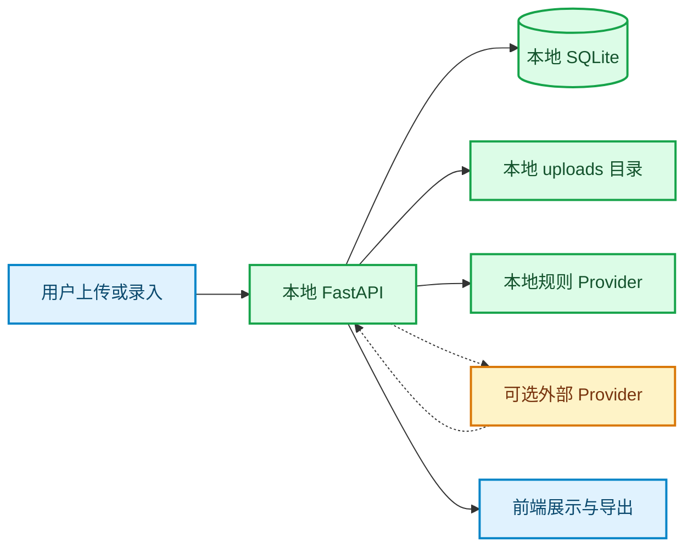

# 学伴管家合规与隐私说明

_面向比赛评审和本地演示的内部说明；不构成法律意见，最后核对日期：2026-08-07_

---

## 🧭 适用范围

当前版本是本地单用户学习管理工具，默认使用 SQLite 和本地文件目录保存数据。系统没有内置账号体系、多人权限和云端数据同步，因此不应把当前版本当作面向公众的生产服务。

## 📦 数据处理范围

| 数据类别 | 可能内容 | 默认存储位置 | 演示处理原则 |
| --- | --- | --- | --- |
| 课程信息 | 课程名、教师、学期、颜色 | `data/app.db` | 使用虚构或脱敏内容 |
| 资料元数据 | 文件名、类型、标签、摘要、处理状态 | `data/app.db` | 不使用私人文件名 |
| 资料正文 | TXT、Markdown、PDF、DOCX 或 OCR 文本 | `data/app.db` | 只使用公开或脱敏样本 |
| 原始文件 | 上传资料的本地副本 | `data/uploads/` | 演示后清理或使用测试数据重置 |
| DDL 任务 | 任务名、截止时间、来源片段、状态 | `data/app.db` | 使用虚构课程任务 |
| 复习计划 | 计划日期、主题、时长、来源 ID | `data/app.db` | 不包含个人身份信息 |
| 外部模型请求 | 仅在配置外部 Provider 时发送抽取文本 | 外部 Provider | 演示优先使用本地规则 Provider |

## 🔐 数据流和边界

默认配置下，抽取使用本地规则 Provider，不需要网络和 API 密钥。只有同时配置 `LLM_API_KEY`、`LLM_MODEL` 和相关地址时，才会启用 OpenAI-compatible Provider。外部 Provider 的可用性、隐私政策和数据留存规则由使用者自行确认。

## 🛡️ 已实现的保护措施

- `.env` 被加入忽略规则，API 密钥不应提交到版本库
- 上传文件执行扩展名、MIME、大小、数量、空文件和文件签名校验
- 原始文件以 SHA-256 内容哈希命名，并拒绝重复内容
- 日志记录请求 ID、方法、路径、状态码和耗时，不记录请求体、文件内容或 API 密钥
- 删除资料时同步删除对应原始文件
- AI 抽取结果先进入预览和人工确认流程，未经确认不会创建正式任务
- 外部模型超时、网络错误和非法 JSON 会进入安全失败状态
- `DEMO_MODE` 默认关闭；开发环境重置接口在非开发/测试环境不可用

## ⚠️ 当前边界和使用要求

- 当前版本没有登录、鉴权和多用户隔离，不应直接暴露到公网
- 本地 SQLite 和 `data/uploads/` 没有自动备份，重要数据需由使用者自行备份
- 复杂自然语言、OCR 和模型输出仍需人工核对，系统结果是建议而非事实证明
- 演示资料必须使用脱敏内容，不得使用真实姓名、学号、手机号、私人聊天记录或未获授权的课程文件
- 配置外部 Provider 前，应先确认其服务条款、数据处理方式和区域要求
- 通过开发接口重置数据前，应确认目标环境为本地开发或测试环境

## 🧹 演示结束清理

1. 在设置页点击“重置测试数据”，或在开发环境调用 `POST /api/dev/reset`
2. 检查 `data/uploads/` 中没有需要保留的文件
3. 删除本地 `.env` 中不再使用的 API 密钥，必要时在 Provider 侧轮换密钥
4. 不把 `data/app.db`、上传原文件或带身份信息的日志打包提交

## 📎 相关实现

- [配置与环境变量](../backend/app/config.py)
- [上传与文件安全校验](../backend/app/services/file_parser.py)
- [资料接口与原始文件删除](../backend/app/api/materials.py)
- [请求日志与统一异常处理](../backend/app/main.py)
- [版本库忽略规则](../.gitignore)
