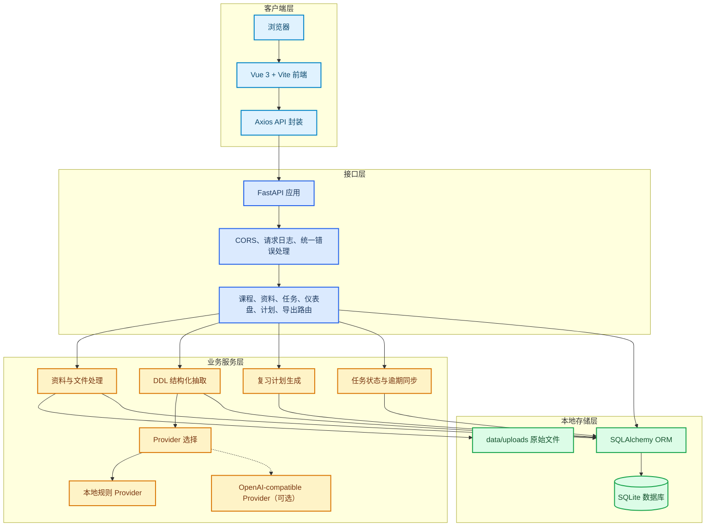
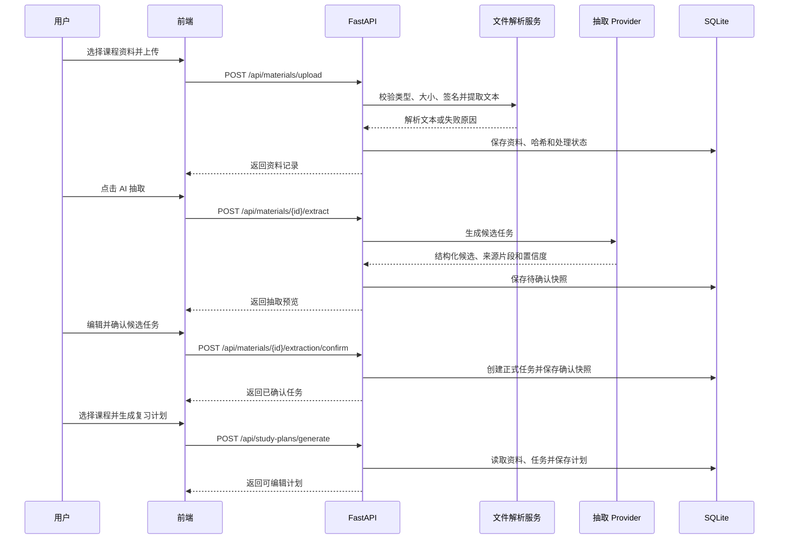

# 学伴管家架构与技术路线

_面向 M8 比赛提交与现场演示的系统架构说明，最后核对日期：2026-08-07_

---

## 🧭 系统概览

学伴管家是一个面向单用户本地演示的学习资料、DDL 任务和复习计划管理应用。前端负责页面交互和状态展示，后端负责业务规则、文件解析、结构化抽取、数据持久化和导出。



## 🧩 核心组件

| 组件 | 代码位置 | 责任 |
| --- | --- | --- |
| Vue 前端 | `frontend/src/` | 页面路由、表单、上传、抽取确认、计划编辑和导出入口 |
| FastAPI 应用 | `backend/app/main.py` | 生命周期、CORS、请求日志、异常处理和路由注册 |
| API 路由 | `backend/app/api/` | 对外 HTTP 接口和请求级校验 |
| 业务服务 | `backend/app/services/` | 文件解析、DDL 抽取、Provider、任务和计划生成规则 |
| 数据模型 | `backend/app/models/` | Course、Material、Task、StudyPlan 及计划明细 |
| SQLite | `data/app.db` | 本地单用户业务数据和轻量迁移后的表结构 |
| 原始文件目录 | `data/uploads/` | 上传文件的 SHA-256 命名副本 |

## 🔄 主要业务流程

下面的流程对应最完整的演示主线：上传资料、解析、人工确认、任务闭环和复习计划。



## 🛡️ 可靠性边界

- 文件上传先做扩展名、MIME、大小、数量、空文件和文件签名校验，再写入本地目录
- 解析失败保留原始文件和失败原因，允许在资料页重试或手动补充正文
- 抽取结果先保存为预览，不会在未经人工确认时直接创建正式任务
- 低置信度、缺失日期、日期冲突和无法回溯来源片段的候选会标记为需复核
- Provider 默认使用本地规则实现，外部模型仅在配置 `LLM_API_KEY`、`LLM_MODEL` 后启用
- 服务启动时通过 `/api/health` 执行数据库连通性检查，并通过 `X-Request-ID` 定位请求日志

## 🚀 本地部署路径

当前交付采用本地 PowerShell 启动方式，适合单机演示。启动脚本见 [`scripts/start-dev.ps1`](../scripts/start-dev.ps1)，完整校验脚本见 [`scripts/verify-local.ps1`](../scripts/verify-local.ps1)。

```text
复制 .env.example 为 .env
        |
        v
设置 DEMO_MODE=true（可选）
        |
        v
运行 scripts/start-dev.ps1
        |
        +--> 后端 http://127.0.0.1:8000/docs
        |
        +--> 前端 http://127.0.0.1:5173/
```

云端部署、认证、多用户隔离、对象存储和 iCal 导出不属于当前版本范围，详见 [`README.md`](../README.md) 的已知限制。

## 🔗 代码索引

- [后端入口](../backend/app/main.py)
- [数据库与轻量迁移](../backend/app/database.py)
- [文件解析服务](../backend/app/services/file_parser.py)
- [结构化抽取服务](../backend/app/services/extraction.py)
- [前端 API 封装](../frontend/src/api/index.js)
